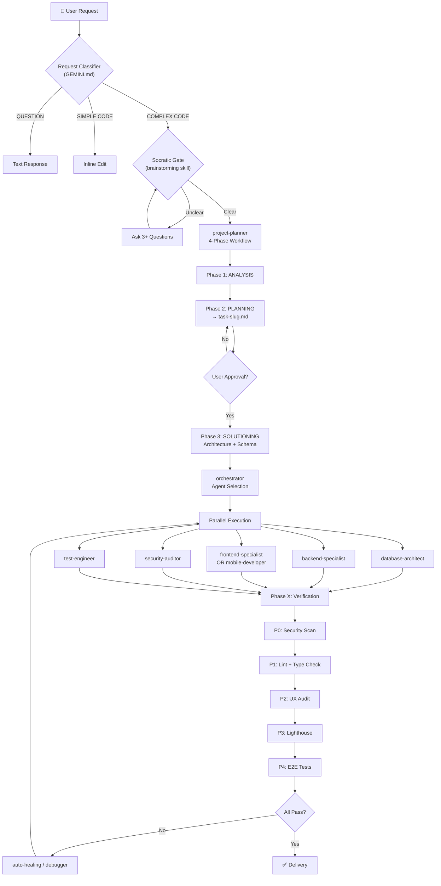

# Antigravity-Core Architecture

> **Version:** 4.0.1 | **Last Updated:** 2026-02-24

---

## System Overview

Antigravity-Core is an **AI-Native Development Operating System** — a structured framework of agents, skills, workflows, rules, and memory that operates as an intelligent development team.

```
┌─────────────────────────────────────────────────────────────────┐
│                    ANTIGRAVITY-CORE (AI OS)                      │
│                                                                  │
│  ┌──────────┐  ┌──────────┐  ┌──────────┐  ┌──────────────────┐ │
│  │  GEMINI  │  │  AGENTS  │  │  SKILLS  │  │     RULES        │ │
│  │  .md     │──│  (27)    │──│  (59)    │──│     (129)        │ │
│  │  (Entry) │  │          │  │          │  │                   │ │
│  └──────────┘  └──────────┘  └──────────┘  └──────────────────┘ │
│       │              │             │               │             │
│       ▼              ▼             ▼               ▼             │
│  ┌──────────┐  ┌──────────┐  ┌──────────┐  ┌──────────────────┐ │
│  │ WORKFLOWS│  │  MEMORY  │  │ SCRIPTS  │  │   STANDARDS      │ │
│  │  (37)    │  │  SYSTEM  │  │  (20)    │  │   & TEMPLATES    │ │
│  └──────────┘  └──────────┘  └──────────┘  └──────────────────┘ │
└─────────────────────────────────────────────────────────────────┘
```

---

## Directory Structure

```
.agent/
├── GEMINI.md              ← System entry point (AI reads this first)
├── ARCHITECTURE.md        ← This file (system map)
├── CHANGELOG.md           ← Version history
├── INTEGRATION-GUIDE.md   ← Team onboarding
├── VERSION                ← Semantic version (4.0.1)
├── project.json           ← System metadata & metrics
│
├── agents/      (27)      ← Agent role definitions
├── workflows/   (37)      ← Automated process definitions
├── skills/      (59)      ← Specialized knowledge modules
├── rules/       (129)     ← Expert coding standards
├── scripts/     (20)      ← PowerShell + Bash automation
├── memory/                ← Persistent context & learning
├── roles/                 ← 7-role SDLC framework
├── templates/             ← Agent & project templates
├── systems/               ← Core protocols (RBA, coordination, orchestration engine, auto-discovery)
├── benchmarks/            ← Performance baselines
├── maintenance/           ← Scheduled tasks
├── examples/              ← RBA & CI/CD examples
└── docs/                  ← Extended documentation
```

---

## Component Details

### 1. Agents (27 definitions)

Specialized AI personas, each with defined scope, skills, and responsibilities.

| Category | Agents | Purpose |
|----------|--------|---------|
| **Core Dev** | backend-specialist, frontend-specialist, laravel-specialist, mobile-developer | Code generation & architecture |
| **Quality** | test-engineer, test-generator, ai-code-reviewer, debugger | Testing & code review |
| **Security** | security-auditor, penetration-tester | Vulnerability assessment & hardening |
| **Architecture** | database-architect, orchestrator, project-planner | System design & coordination |
| **Operations** | devops-engineer, performance-optimizer, manager-agent | Deployment & optimization |
| **Specialized** | game-designer, mobile-game-developer, pc-game-developer, seo-specialist | Domain-specific expertise |
| **Automation** | self-correction-agent, triage-agent, refactor-agent, code-generator-agent, explorer-agent | Autonomous improvement |
| **Documentation** | documentation-agent, documentation-writer | Auto-sync docs |

**Agent Relationships:**

| Agent Pair | Relationship |
|------------|-------------|
| `test-engineer` ↔ `test-generator` | Strategy/infrastructure (engineer) vs code generation (generator) |
| `security-auditor` ↔ `penetration-tester` | Defensive review (auditor) vs offensive testing (tester) |
| `documentation-agent` ↔ `documentation-writer` | Automated sync (agent) vs user-requested writing (writer) |

### 2. Workflows (37 processes)

Slash-command triggered automation pipelines.

| Phase | Workflows |
|-------|-----------|
| **Planning** | `/brainstorm`, `/plan`, `/requirements-first`, `/orchestrate` |
| **Development** | `/create`, `/create-admin`, `/scaffold`, `/schema-first`, `/enhance` |
| **Quality** | `/check`, `/test`, `/code-review-automation`, `/api-design` |
| **Security** | `/security-audit`, `/secret-scanning` |
| **Performance** | `/optimize`, `/auto-optimization-cycle`, `/performance-budget-enforcement` |
| **Deployment** | `/deploy`, `/mobile-deploy`, `/mobile-init`, `/mobile-test` |
| **Maintenance** | `/maintain`, `/debug`, `/quickfix`, `/auto-healing`, `/refactor`, `/migrate`, `/backup`, `/i18n-check` |
| **Design** | `/ui-ux-pro-max`, `/update-ui-ux-pro-max`, `/admin-component`, `/admin-dashboard` |
| **System** | `/install-antigravity`, `/sync-admin` |

### 3. Skills (59 modules)

Self-contained knowledge domains with SKILL.md instruction files.

| Domain | Skills |
|--------|--------|
| **Frontend** | react-patterns, vue-expert, tailwind-patterns, nextjs-best-practices, state-management |
| **Backend** | laravel-performance, nestjs-expert, nodejs-best-practices, prisma-expert |
| **Mobile** | mobile-design, game-development |
| **Infrastructure** | docker-expert, kubernetes-patterns, terraform-iac, cloudflare, server-management |
| **Testing** | testing-mastery, testing-patterns, tdd-workflow, contract-testing, webapp-testing |
| **Security** | vulnerability-scanner, red-team-tactics |
| **AI/ML** | ai-sdk-expert, vector-databases, mcp-builder |
| **Design** | ui-ux-pro-max, frontend-design |
| **Meta** | clean-code, architecture-mastery, brainstorming, plan-writing, behavioral-modes |

### 4. Rules (129 files, 11 categories)

Expert-level coding standards auto-loaded by context detection.

| Category | Files | Trigger |
|----------|-------|---------|
| database/ | 10 | `.sql`, DB keywords |
| mobile/ | 10 | `.swift`, `.kt`, `.dart` |
| backend-frameworks/ | 12 | `.php`, `.py`, framework configs |
| frontend-frameworks/ | 7 | `.vue`, `.svelte`, `.astro` |
| typescript/ | 13 | `.ts`, `.tsx` |
| nextjs/ | 13 | `next.config.*` |
| python/ | 14 | `.py`, requirements |
| web-development/ | 12 | `.html`, `.css`, `.js` |
| agentic-ai/ | 12 | Debug, test, review keywords |
| standards/ | 25 | Always active (16 general + 9 framework) |
| shared/ | 1 | Common utilities |

### 5. Memory System

Persistent YAML files that maintain context across sessions.

| File | Purpose | Scope |
|------|---------|-------|
| `user-profile.yaml` | Developer preferences & stack | Per-user |
| `capability-boundaries.yaml` | AI confidence levels (0-100) | Per-domain |
| `learning-patterns.yaml` | Proven approaches | Cumulative |
| `tech-radar.yaml` | Technology adoption decisions | Team-level |
| `feedback.yaml` | Improvement tracking | Cumulative |
| `confidence-calibration.yaml` | Accuracy benchmarks | System |
| `experiments.yaml` | A/B testing data | System |
| `predictive-improvements.yaml` | Proactive suggestions | System |

### 6. Core Protocols

| Protocol | File | Purpose |
|----------|------|---------|
| **RBA** | `systems/rba-validator.md` | Reasoning-Before-Action (mandatory for all agents) |
| **AOC** | `agents/manager-agent.md` | Auto-Optimization Cycle |
| **Agent Coordination** | `systems/agent-coordination.md` | Multi-agent coordination |
| **Orchestration Engine** | `systems/orchestration-engine.md` | Automated agent selection & pipeline execution |
| **Auto-Rule Discovery** | `systems/auto-rule-discovery.md` | Intelligent rule loading by project context |
| **Agent Registry** | `systems/agent-registry.md` | Machine-readable 27-agent capability registry |
| **STANDARDS** | `rules/STANDARDS.md` | Golden Rule — technical constitution |

---

## File Dependencies

When modifying any file below, **co-update ALL dependent files** listed.

| When You Modify | Also Update |
|-----------------|-------------|
| An agent (`agents/*.md`) | `ARCHITECTURE.md` counts, `systems/agent-registry.md`, `GEMINI.md` agent list |
| A skill (`skills/*/SKILL.md`) | `ARCHITECTURE.md` counts, referencing agent frontmatter |
| A workflow (`workflows/*.md`) | `ARCHITECTURE.md` counts, `GEMINI.md` workflow list |
| A rule (`rules/**/*.md`) | `ARCHITECTURE.md` counts, `rules/RULES-INDEX.md`, `systems/auto-rule-discovery.md` |
| A script (`scripts/*.ps1`) | `ARCHITECTURE.md` counts, `GEMINI.md` script table |
| `GEMINI.md` | `ARCHITECTURE.md` (if counts change) |
| `ARCHITECTURE.md` | `CHANGELOG.md` (if version bump) |

---

## Data Flow

```
User Request
    │
    ▼
GEMINI.md (Entry Point)
    │
    ├── Classify Request Type
    ├── Load Memory Context
    ├── Check Capability Boundaries
    │
    ▼
Auto-Rule Discovery Engine (systems/auto-rule-discovery.md)
    │
    ├── Layer 1: File Extension Scan
    ├── Layer 2: Project Config Scan
    ├── Layer 3: Request Keyword Analysis
    ├── Merge, Rank & Resolve Dependencies
    │
    ▼
Orchestration Engine (systems/orchestration-engine.md)
    │
    ├── Context Analysis (domain, complexity, scope)
    ├── Agent Selection (via agent-registry.md)
    ├── Conflict Resolution
    │
    ▼
RBA Protocol (Reasoning-Before-Action)
    │
    ├── PROCEED → Execute with pipeline
    ├── ESCALATE → Ask user
    └── ALTERNATIVE → Suggest different approach
    │
    ▼
Pipeline Execution (Sequential / Parallel / Conditional)
    │
    ├── Generate artifacts
    ├── Run quality gates
    ├── Update memory
    │
    ▼
Output (Code + Tests + Docs)
```

### Orchestration Workflow Diagram



---

## Cross-Platform Support

| Component | Windows | Linux/Mac |
|-----------|---------|-----------|
| Scripts (`.ps1`) | ✅ Native | ⚠️ Requires pwsh |
| Agent definitions | ✅ | ✅ |
| Skills & Rules | ✅ | ✅ |
| Benchmarks (`.sh`) | ⚠️ WSL | ✅ Native |
| Installation | ✅ PowerShell | ✅ Git clone |

---

## Key Files to Read First

1. **This file** — System map
2. **`GEMINI.md`** — AI behavior configuration
3. **`roles/AGENT_ROLES.md`** — 7-role SDLC framework
4. **`systems/agent-registry.md`** — 27-agent capability registry
5. **`rules/STANDARDS.md`** — Quality standards (Golden Rule)
6. **`INTEGRATION-GUIDE.md`** — Team onboarding

---

**Maintained by:** Antigravity AI System  
**Source:** [github.com/tuyenht/Antigravity-Core](https://github.com/tuyenht/Antigravity-Core)
