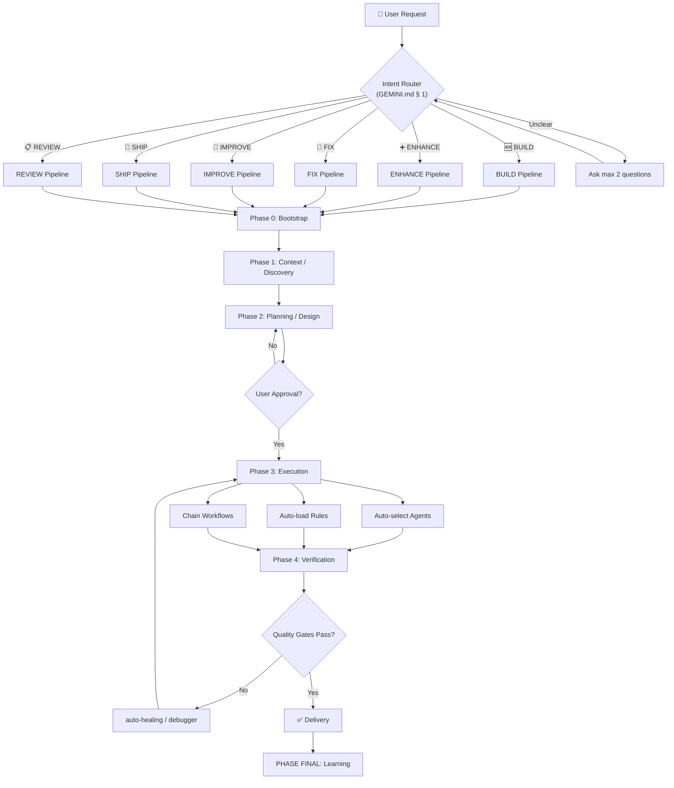

# Antigravity-Core Architecture

> **Version:** 5.0.1 | **Last Updated:** 2026-02-27

---

## System Overview

Antigravity-Core is an **AI-Native Development Operating System** — a structured framework of agents, skills, workflows, rules, and memory that operates as an intelligent development team.

### 3-Layer "Zero-Confusion" Architecture (v5.0)

```
┌──────────────────────────────────────────────────────────────────┐
│  LAYER 1: GEMINI.md SLIM (~6KB)                                  │
│  → Core Rules + Intent Router pointer + Lazy Load protocol       │
├──────────────────────────────────────────────────────────────────┤
│  LAYER 2: INTENT ROUTER (systems/intent-router.md)               │
│  → Classify request → 1 of 6 intents → activate Pipeline Chain  │
│                                                                   │
│  ┌────────┐ ┌────────┐ ┌────────┐                                │
│  │ BUILD  │ │ENHANCE │ │  FIX   │                                │
│  ├────────┤ ├────────┤ ├────────┤                                │
│  │IMPROVE │ │  SHIP  │ │ REVIEW │                                │
│  └────────┘ └────────┘ └────────┘                                │
├──────────────────────────────────────────────────────────────────┤
│  LAYER 3: PIPELINE CHAINS (pipelines/)                           │
│  → Auto-sequence workflows + agents for end-to-end execution     │
├──────────────────────────────────────────────────────────────────┤
│  ENGINE: 27 Agents │ 59 Skills │ 108 Rules │ 34 Workflows         │
│          20 Scripts │ Memory │ Standards │ Templates              │
│  → Reference: reference-catalog.md (lazy-loaded)                 │
└──────────────────────────────────────────────────────────────────┘
```

---

## Directory Structure

```
.agent/
├── GEMINI.md              ← System entry point (SLIM ~6KB, AI reads this first)
├── reference-catalog.md   ← All lookup tables (lazy-loaded, NOT read at start)
├── ARCHITECTURE.md        ← This file (system map)
├── CHANGELOG.md           ← Version history
├── VERSION                ← Semantic version (5.0.0)
├── project.json           ← System metadata & metrics
│
├── pipelines/   (6)       ← Pipeline Chains (BUILD, ENHANCE, FIX, IMPROVE, SHIP, REVIEW)
├── agents/      (27)      ← Agent role definitions
├── workflows/   (34)      ← Automated process definitions (used by pipelines)
├── skills/      (59)      ← Specialized knowledge modules
├── rules/       (108)     ← Expert coding standards
├── scripts/     (20)      ← PowerShell + Bash automation
├── systems/               ← Core protocols (Intent Router, RBA, orchestration, auto-discovery)
├── memory/                ← Persistent context & learning
├── roles/                 ← 7-role SDLC framework
├── templates/             ← Agent & project templates
├── benchmarks/            ← Performance baselines
├── maintenance/           ← Scheduled tasks
├── examples/              ← RBA & CI/CD examples
└── docs/                  ← Extended documentation
```

---

## Component Details

### 1. Agents (27 definitions)

Specialized AI personas, each with defined scope, skills, and responsibilities.

| Category | Agents | Purpose |
|----------|--------|---------|
| **Core Dev** | backend-specialist, frontend-specialist, laravel-specialist, mobile-developer | Code generation & architecture |
| **Quality** | test-engineer, test-generator, ai-code-reviewer, debugger | Testing & code review |
| **Security** | security-auditor, penetration-tester | Vulnerability assessment & hardening |
| **Architecture** | database-architect, orchestrator, project-planner, explorer-agent | System design, coordination & discovery |
| **Operations** | devops-engineer, performance-optimizer, manager-agent | Deployment & optimization |
| **Specialized** | game-designer, mobile-game-developer, pc-game-developer, seo-specialist | Domain-specific expertise |
| **Automation** | self-correction-agent, triage-agent, refactor-agent, code-generator-agent | Autonomous improvement |
| **Documentation** | documentation-agent, documentation-writer | Auto-sync docs |

**Agent Relationships:**

| Agent Pair | Relationship |
|------------|-------------|
| `test-engineer` ↔ `test-generator` | Strategy/infrastructure (engineer) vs code generation (generator) |
| `security-auditor` ↔ `penetration-tester` | Defensive review (auditor) vs offensive testing (tester) |
| `documentation-agent` ↔ `documentation-writer` | Automated sync (agent) vs user-requested writing (writer) |

### 2. Pipeline Chains (6 automated flows) — **NEW in v5.0**

Auto-sequenced end-to-end workflows triggered by the Intent Router.

| Pipeline | Intent | Phases | Key Agents |
|----------|--------|--------|------------|
| `BUILD.md` | 🆕 Tạo mới | Discovery → Planning → Scaffolding → Quality → Delivery | project-planner, backend/frontend-specialist |
| `ENHANCE.md` | ➕ Thêm tính năng | Context → Design → Implement → Verify | explorer, project-planner, domain agent |
| `FIX.md` | 🔧 Sửa lỗi | Reproduce → Diagnose → Fix → Verify | debugger, domain agent, test-engineer |
| `IMPROVE.md` | 🔄 Cải thiện | Analyze → Plan → Execute → Verify | ai-code-reviewer, refactor-agent |
| `SHIP.md` | 🚀 Triển khai | Pre-flight → Build → Deploy → Post-deploy | security-auditor, devops-engineer |
| `REVIEW.md` | 📋 Đánh giá | Scan (parallel) → Report → Action | ai-code-reviewer, security-auditor |

### 3. Workflows (34 processes)

Slash-command triggered automation pipelines. Also used internally by Pipeline Chains.

| Phase | Workflows |
|-------|-----------|
| **Planning** | `/brainstorm`, `/plan`, `/requirements-first`, `/orchestrate` |
| **Development** | `/create`, `/create-admin`, `/scaffold`, `/schema-first`, `/enhance` |
| **Quality** | `/check`, `/test`, `/api-design` |
| **Security** | `/security-audit`, `/secret-scanning` |
| **Performance** | `/optimize`, `/auto-optimization-cycle`, `/performance-budget-enforcement` |
| **Deployment** | `/deploy`, `/mobile-deploy`, `/mobile-test` |
| **Maintenance** | `/maintain`, `/debug`, `/quickfix`, `/auto-healing`, `/refactor`, `/backup`, `/i18n-check` |
| **Design** | `/ui-ux-pro-max`, `/update-ui-ux-pro-max`, `/admin-component`, `/admin-dashboard`, `/admin-settings` |
| **System** | `/full-pipeline`, `/sync-admin` |

### 4. Skills (59 modules)

Self-contained knowledge domains with SKILL.md instruction files.

| Domain | Skills |
|--------|--------|
| **Frontend** | react-patterns, vue-expert, tailwind-patterns, nextjs-best-practices, state-management |
| **Backend** | laravel-performance, nestjs-expert, nodejs-best-practices, prisma-expert |
| **Mobile** | mobile-design, game-development |
| **Infrastructure** | docker-expert, kubernetes-patterns, terraform-iac, cloudflare, server-management |
| **Testing** | testing-mastery, testing-patterns, tdd-workflow, contract-testing, webapp-testing |
| **Security** | vulnerability-scanner, red-team-tactics |
| **AI/ML** | ai-sdk-expert, vector-databases, mcp-builder |
| **Design** | ui-ux-pro-max, frontend-design |
| **Meta** | clean-code, architecture-mastery, brainstorming, plan-writing, behavioral-modes |

### 5. Rules (108 files, 11 categories)

Expert-level coding standards auto-loaded by context detection.

| Category | Files | Trigger |
|----------|-------|---------|
| database/ | 10 | `.sql`, DB keywords |
| mobile/ | 10 | `.swift`, `.kt`, `.dart` |
| backend-frameworks/ | 12 | `.php`, `.py`, framework configs |
| frontend-frameworks/ | 7 | `.vue`, `.svelte`, `.astro` |
| typescript/ | 13 | `.ts`, `.tsx` |
| nextjs/ | 13 | `next.config.*` |
| python/ | 14 | `.py`, requirements |
| web-development/ | 12 | `.html`, `.css`, `.js` |
| agentic-ai/ | 12 | Debug, test, review keywords |
| standards/ | 4 | Always active (1 general + 3 framework conventions) |
| shared/ | 1 | Common utilities |

### 6. Memory System

Persistent YAML files that maintain context across sessions.

| File | Purpose | Scope |
|------|---------|-------|
| `user-profile.yaml` | Developer preferences & stack | Per-user |
| `capability-boundaries.yaml` | AI confidence levels (0-100) | Per-domain |
| `learning-patterns.yaml` | Proven approaches | Cumulative |
| `tech-radar.yaml` | Technology adoption decisions | Team-level |
| `feedback.yaml` | Improvement tracking | Cumulative |
| `confidence-calibration.yaml` | Accuracy benchmarks | System |
| `experiments.yaml` | A/B testing data | System |
| `predictive-improvements.yaml` | Proactive suggestions | System |

### 7. Core Protocols

| Protocol | File | Purpose |
|----------|------|---------|
| **Intent Router** | `systems/intent-router.md` | Universal request classification (v5.0) |
| **RBA** | `systems/rba-validator.md` | Reasoning-Before-Action (mandatory for all agents) |
| **AOC** | `agents/manager-agent.md` | Auto-Optimization Cycle |
| **Agent Coordination** | `systems/agent-coordination.md` | Multi-agent coordination |
| **Orchestration Engine** | `systems/orchestration-engine.md` | Automated agent selection & pipeline execution |
| **Auto-Rule Discovery** | `systems/auto-rule-discovery.md` | Intelligent rule loading by project context |
| **Agent Registry** | `systems/agent-registry.md` | Machine-readable 27-agent capability registry |

---

## File Dependencies

When modifying any file below, **co-update ALL dependent files** listed.

| When You Modify | Also Update |
|-----------------|-------------|
| An agent (`agents/*.md`) | `ARCHITECTURE.md` counts, `project.json` stats, `systems/agent-registry.md` |
| A skill (`skills/*/SKILL.md`) | `ARCHITECTURE.md` counts, `project.json` stats, referencing agent frontmatter |
| A workflow (`workflows/*.md`) | `ARCHITECTURE.md` counts, `project.json` stats |
| A rule (`rules/**/*.md`) | `ARCHITECTURE.md` counts, `project.json` stats, `systems/auto-rule-discovery.md` |
| A script (`scripts/*.ps1`) | `ARCHITECTURE.md` counts, `project.json` stats |
| `GEMINI.md` | `ARCHITECTURE.md` (if structure changes) |
| `ARCHITECTURE.md` | `CHANGELOG.md` (if version bump), `project.json` |
| Any component count | `project.json` stats (single source of truth for counts) |

---

## Data Flow (v5.0 — Zero-Confusion)

```
User Request (natural language)
    │
    ▼
GEMINI.md SLIM (§ 1: Intent Router)
    │
    ├── Classify → 1 of 6 intents (BUILD/ENHANCE/FIX/IMPROVE/SHIP/REVIEW)
    │                ↕ If unclear → Ask max 2 questions → re-classify
    │
    ▼
Pipeline Chain (pipelines/{INTENT}.md)
    │
    ├── Phase 1: Context/Discovery
    ├── Phase 2: Planning/Design
    │     └── ⛔ Checkpoint (user approve if complex)
    ├── Phase 3: Execution
    │     ├── Auto-select Agents (via pipeline spec)
    │     ├── Auto-load Rules (via auto-rule-discovery.md)
    │     └── Chain existing workflows (/create, /scaffold, etc.)
    ├── Phase 4: Verification
    │     └── Tests + Lint + Quality gates
    │
    ▼
Output (Code + Tests + Report)
```

### v5.0 Pipeline Flow Diagram



---

## Cross-Platform Support

| Component | Windows | Linux/Mac |
|-----------|---------|-----------|
| Scripts (`.ps1`) | ✅ Native | ⚠️ Requires pwsh |
| Agent definitions | ✅ | ✅ |
| Skills & Rules | ✅ | ✅ |
| Benchmarks (`.sh`) | ⚠️ WSL | ✅ Native |
| Installation | ✅ PowerShell | ✅ Git clone |

---

## Key Files to Read First

1. **This file** — System map
2. **`GEMINI.md`** — AI behavior configuration
3. **`pipelines/`** — 6 Pipeline Chains (v5.0 core)
4. **`systems/intent-router.md`** — Request classification protocol
5. **`systems/agent-registry.md`** — 27-agent capability registry
6. **`reference-catalog.md`** — All lookup tables (lazy-loaded)

---

**Maintained by:** Antigravity AI System  
**Source:** [github.com/tuyenht/Antigravity-Core](https://github.com/tuyenht/Antigravity-Core)
