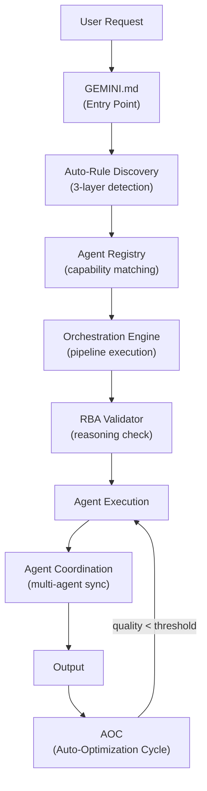
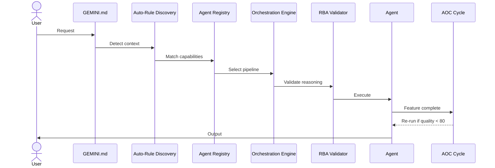

# Systems & Protocols Catalog — Antigravity-Core

**Version:** 5.0.0  
**Last Updated:** 2026-02-27  
**Total Systems:** 6 (5 files + AOC in manager-agent)

---

## Overview

Systems là các **core protocols** định nghĩa cách hệ thống hoạt động. Nằm trong `.agent/systems/`.

---

## System Architecture



---

## Protocol Registry

### 1. RBA — Reasoning-Before-Action

| Field | Value |
|-------|-------|
| **File** | `systems/rba-validator.md` |
| **Mục đích** | Bắt buộc agent phải suy luận trước khi thực thi code |
| **Khi nào** | TRƯỚC mọi create/edit/delete file action |
| **Ai phải tuân thủ** | Tất cả 27 agents |

**Required Fields trong Reasoning Block:**
- `analysis` — objective, scope, dependencies
- `potential_impact` — affected modules, breaking changes, rollback
- `edge_cases` — tối thiểu 3
- `validation_criteria` — tối thiểu 3
- `decision` — PROCEED / ESCALATE / ALTERNATIVE
- `reason` — giải thích quyết định

**Violation:** Nếu skip RBA → output INVALID

---

### 2. Auto-Rule Discovery Engine

| Field | Value |
|-------|-------|
| **File** | `systems/auto-rule-discovery.md` |
| **Mục đích** | Tự động phát hiện và load rules phù hợp với context |
| **3 Layers** | File extension → Project config → Request keywords |

**Detection Flow:**
```
Step 1: ANALYZE CONTEXT
├── Active document file extension (.vue, .swift, .py...)
├── Project config files (package.json, composer.json...)
└── Keywords in user request

Step 2: MATCH RULES
├── File extension → Load matching rules
├── Project type → Load framework rules
└── Request keywords → Load domain rules

Step 3: APPLY RULES (max 3-7)
├── Read matched rules
├── Limit by context
└── Apply patterns
```

---

### 3. Agent Registry

| Field | Value |
|-------|-------|
| **File** | `systems/agent-registry.md` |
| **Mục đích** | Machine-readable capability registry cho tất cả 27 agents |
| **Chứa gì** | Triggers, skills, conflict rules, complexity ranges cho mỗi agent |

**Key Functions:**
- Agent capability matching (request → best agent)
- Conflict resolution (frontend ≠ mobile)
- Complexity-based routing (simple vs complex tasks)

---

### 4. Orchestration Engine

| Field | Value |
|-------|-------|
| **File** | `systems/orchestration-engine.md` |
| **Mục đích** | Automated agent selection và pipeline execution |
| **Pipeline Types** | Sequential, Parallel, Conditional |
| **Templates** | 7 pipeline templates cho common scenarios |

**Pipeline Templates:**
1. Full-stack feature development
2. Security audit
3. Performance optimization
4. Code review
5. Database migration
6. Mobile development
7. Game development

---

### 5. Agent Coordination

| Field | Value |
|-------|-------|
| **File** | `systems/agent-coordination.md` |
| **Mục đích** | Đồng bộ nhiều agents khi cùng làm việc trên cùng codebase |

**Key Concepts:**
- File ownership (mỗi file thuộc 1 agent domain)
- Conflict prevention (agent A không sửa file của agent B)
- Context sharing (pass findings giữa agents)
- State management (PENDING → RUNNING → DONE → ERROR)

---

### 6. AOC — Auto-Optimization Cycle

| Field | Value |
|-------|-------|
| **File** | `agents/manager-agent.md` (embedded) |
| **Mục đích** | Tự động optimize code sau mỗi feature completion |
| **Cycle Time** | 180 seconds max |
| **Coordinator** | `manager-agent` |

**Cycle Flow:**
```
Feature completed
    ↓
manager-agent activates
    ↓
self-correction-agent → Fix lint/type/test errors (max 3 iterations)
    ↓
documentation-agent → Update docs
    ↓
refactor-agent → Suggest improvements
    ↓
Quality score check
    ↓
If score < 80 → Re-run cycle
If score >= 80 → DONE ✅
```

---

## Data Flow (Complete)



---

> **See also:** [ARCHITECTURE.md](../../ARCHITECTURE.md) | [Agent Catalog](../agents/AGENT-CATALOG.md)
