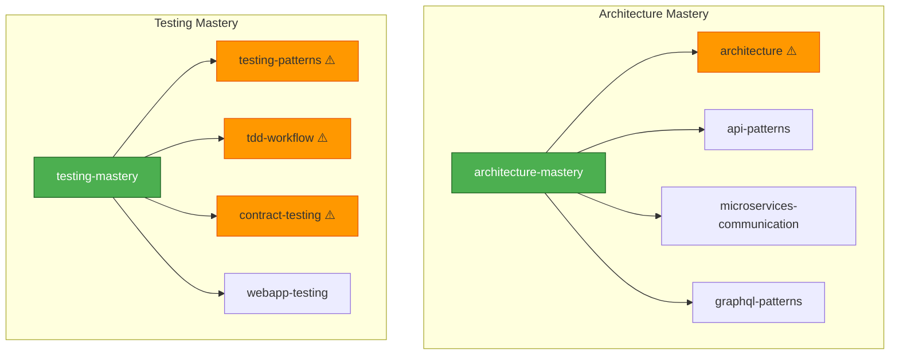
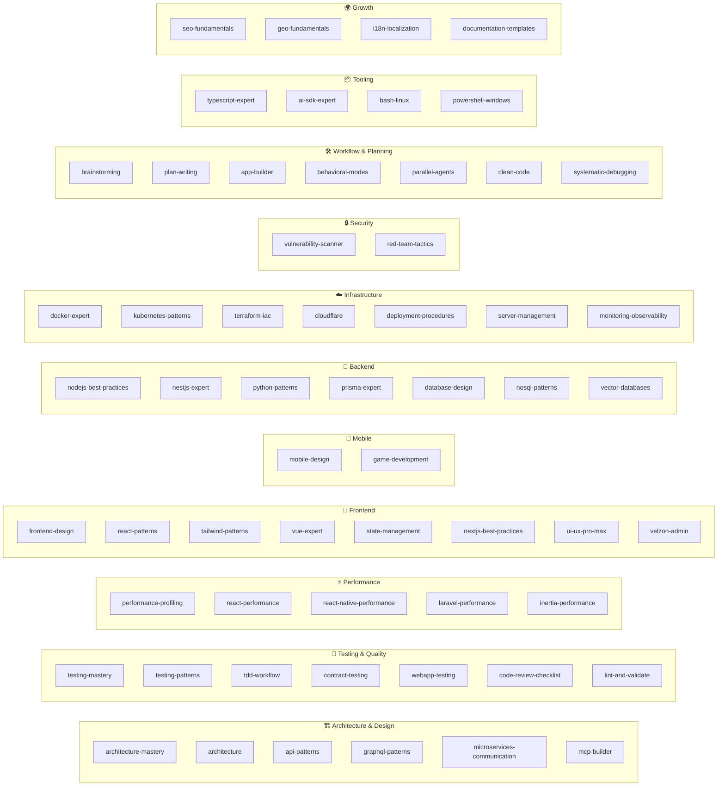

# Skill Dependency & Consolidation Graph

> **Version:** 5.0.0 | **Skills:** 59 | **Last Updated:** 2026-02-26
> **Purpose:** Visual map of skill relationships, consolidations, and dependency chains.

---

## Consolidation Map

These "mastery" skills consolidate multiple original skills into single sources of truth.
Original skills remain available but contain deprecation notices pointing to their mastery version.



> ⚠️ = Deprecated (has deprecation notice, use mastery version instead)

---

## Skill Categories



---

## Cross-Skill Dependencies

When a skill is loaded, these related skills should also be considered:

| Skill | Depends On | Enhances |
|-------|-----------|----------|
| `react-performance` | `react-patterns` | `nextjs-best-practices` |
| `react-native-performance` | `mobile-design` | `game-development` |
| `laravel-performance` | `database-design` | `inertia-performance` |
| `inertia-performance` | `laravel-performance`, `react-patterns` | — |
| `velzon-admin` | `react-patterns`, `state-management` | `frontend-design` |
| `nextjs-best-practices` | `react-patterns`, `typescript-expert` | `seo-fundamentals` |
| `webapp-testing` | `testing-patterns` | `performance-profiling` |
| `vulnerability-scanner` | `red-team-tactics` | — |
| `kubernetes-patterns` | `docker-expert` | `terraform-iac` |
| `prisma-expert` | `database-design`, `typescript-expert` | `nestjs-expert` |
| `cloudflare` | `deployment-procedures` | `server-management` |
| `ai-sdk-expert` | `typescript-expert`, `react-patterns` | — |
| `architecture-mastery` | `api-patterns`, `database-design` | `app-builder` |
| `testing-mastery` | `testing-patterns`, `tdd-workflow` | `webapp-testing` |
| `app-builder` | `brainstorming`, `plan-writing`, `architecture-mastery` | — |

---

## Skill Loading Priority

```
1. MANDATORY (always loaded)
   └── clean-code

2. TASK-TRIGGERED
   ├── brainstorming ← complex/unclear requests
   ├── plan-writing ← multi-file tasks
   ├── systematic-debugging ← bug fixes
   └── behavioral-modes ← mode switching

3. TECH-TRIGGERED (by file extension / project type)
   ├── react-patterns ← .tsx
   ├── vue-expert ← .vue
   ├── python-patterns ← .py
   ├── prisma-expert ← schema.prisma
   └── typescript-expert ← .ts

4. MASTERY (loaded instead of originals)
   ├── architecture-mastery ← replaces architecture
   └── testing-mastery ← replaces testing-patterns + tdd + contract
```

---

## Deprecation Status

| Skill | Status | Replacement |
|-------|--------|-------------|
| `architecture` | ⚠️ Deprecated | `architecture-mastery` |
| `testing-patterns` | ⚠️ Deprecated | `testing-mastery` |
| `tdd-workflow` | ⚠️ Deprecated | `testing-mastery` |
| `contract-testing` | ⚠️ Deprecated | `testing-mastery` |
| All other 55 skills | ✅ Active | — |

---

**Maintainer:** Antigravity Core System
