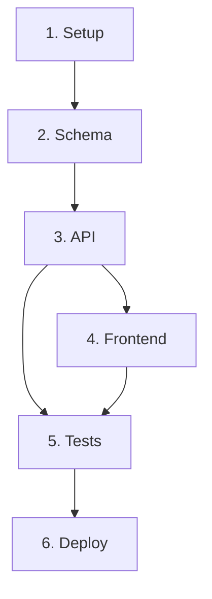

# /plan — Project Planning Mode

// turbo-all

$ARGUMENTS

**Agent:** `project-planner`  
**Skills:** `plan-writing`, `brainstorming`, `architecture`

---

## 🔴 CRITICAL RULES

1. **NO CODE WRITING** — This command creates plan file only
2. **Use project-planner agent** — NOT Claude Code's native Plan subagent
3. **Socratic Gate** — Ask clarifying questions before planning
4. **Dynamic Naming** — Plan file named based on task

---

## Phase 0: Socratic Gate

Trước khi plan, HỎI user tối thiểu:

1. **Scope:** Tính năng chính? MVP hay full?
2. **Users:** Ai sử dụng? Bao nhiêu users?
3. **Tech stack:** Đã chọn chưa? Constraints?
4. **Timeline:** Deadline? Phải ship khi nào?
5. **Dependencies:** Cần integrate với gì? API nào?

> ⛔ KHÔNG tạo plan cho đến khi user trả lời đủ questions.

---

## Phase 1: Create Plan File

```
CONTEXT:
- User Request: $ARGUMENTS
- Mode: PLANNING ONLY (no code)
- Output: docs/PLAN-{task-slug}.md (dynamic naming)

NAMING RULES:
1. Extract 2-3 key words from request
2. Lowercase, hyphen-separated
3. Max 30 characters
4. Example: "e-commerce cart" → PLAN-ecommerce-cart.md
```

---

## Plan Template

Plan file PHẢI có các sections sau:

```markdown
# PLAN: {Task Name}

## 1. Overview
- Goal: [1-2 sentences]
- Type: New Feature | Bugfix | Refactor | New Project
- Estimated effort: [S/M/L/XL]

## 2. Requirements
- [ ] Req 1
- [ ] Req 2
- ...

## 3. Architecture Decisions
| Decision | Choice | Reasoning |
|----------|--------|-----------|
| Database | PostgreSQL | Need complex queries + JSONB |
| Auth | NextAuth.js | Social login support |

## 4. Task Breakdown
| # | Task | Agent | Est. | Depends On |
|---|------|-------|------|------------|
| 1 | Setup project | project-planner | 1h | - |
| 2 | Database schema | database-architect | 2h | 1 |
| 3 | API endpoints | backend-specialist | 4h | 2 |
| 4 | Frontend UI | frontend-specialist | 4h | 3 |
| 5 | Tests | test-engineer | 2h | 3, 4 |
| 6 | Deploy | devops-engineer | 1h | 5 |

## 5. Dependency Map


## 6. Risk Assessment
| Risk | Impact | Likelihood | Mitigation |
|------|--------|------------|------------|
| API delay | High | Medium | Start FE with mock data |
| Scope creep | High | High | Strict MVP definition |

## 7. Verification Criteria
- [ ] All tasks completed
- [ ] Tests pass (≥80% coverage)
- [ ] Security audit clean
- [ ] Performance within targets
- [ ] DoD met

## 8. Timeline
| Sprint | Tasks | Deliverable |
|--------|-------|-------------|
| Sprint 1 | #1-#3 | API working |
| Sprint 2 | #4-#6 | Full app deployed |
```

---

## Expected Output

| Deliverable | Location |
|-------------|----------|
| Project Plan | `docs/PLAN-{task-slug}.md` |
| Task Breakdown | Inside plan (section 4) |
| Dependency Map | Inside plan (section 5) |
| Risk Assessment | Inside plan (section 6) |
| Agent Assignments | Inside plan (section 4) |
| Verification Checklist | Inside plan (section 7) |

---

## After Planning

```
✅ Plan created: docs/PLAN-{slug}.md

Next steps:
├── Review the plan
├── /create or /enhance → Start implementation
├── /schema-first → If DB-heavy project
└── /full-pipeline → Full team workflow
```

---

## Naming Examples

| Request | Plan File |
|---------|-----------|
| `/plan e-commerce site with cart` | `docs/PLAN-ecommerce-cart.md` |
| `/plan mobile app for fitness` | `docs/PLAN-fitness-app.md` |
| `/plan add dark mode feature` | `docs/PLAN-dark-mode.md` |
| `/plan SaaS dashboard` | `docs/PLAN-saas-dashboard.md` |

---

## Usage

```
/plan e-commerce site with cart
/plan mobile app for fitness tracking
/plan SaaS dashboard with analytics
/plan refactor authentication module
```


---

## Troubleshooting

| Vấn đề | Giải pháp |
|---------|-----------|
| Lỗi không xác định hoặc crash | Bật chế độ verbose, kiểm tra log hệ thống, cắt nhỏ phạm vi debug |
| Thiếu package/dependencies | Kiểm tra file lock, chạy lại npm/composer install |
| Xung đột context API | Reset session, tắt các plugin/extension không liên quan |
| Thời gian chạy quá lâu (timeout) | Cấu hình lại timeout, tối ưu hóa các queries nặng |
