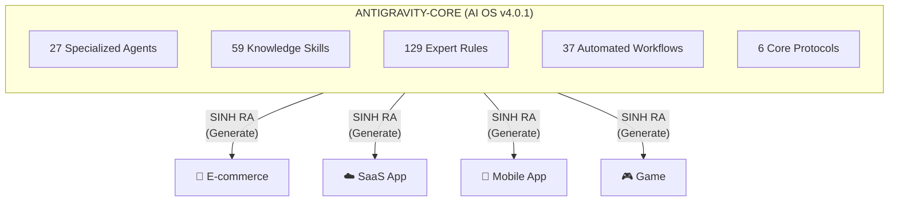
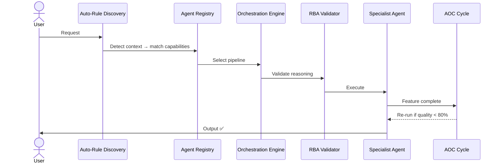

# 🚀 ANTIGRAVITY-CORE

> **AI-Native Development Operating System**  
> Hệ Điều Hành Phát Triển Phần Mềm Thuần AI

[](.agent/CHANGELOG.md)
[](.agent/docs/agents/AGENT-CATALOG.md)
[](.agent/docs/skills/SKILL-CATALOG.md)
[](.agent/docs/rules/RULES-CATALOG.md)
[]()
[]()
[]()

---

## 🎯 TẦM NHÌN

**Antigravity-Core** không phải là một framework hay library.  
Đây là một **Hệ Điều Hành** (Operating System) cho việc phát triển phần mềm với AI.



### Khác biệt với AI Coding truyền thống

| Traditional AI Coding | Antigravity-Core |
|----------------------|------------------|
| 🔴 Passive code generator | 🟢 **27 chuyên gia AI** phối hợp |
| 🔴 Context-lost every session | 🟢 **Persistent memory system** |
| 🔴 Generic responses | 🟢 **129 expert rules** tự động load |
| 🔴 No quality gates | 🟢 **Platinum Standard** enforcement |

| 🔴 Trial and error | 🟢 **59 proven skill modules** |
| 🔴 One-size-fits-all | 🟢 **Auto-detection** tech stack |

---

## ⚡ QUICK START

### 📋 Prerequisites

- **Git** đã cài đặt ([git-scm.com](https://git-scm.com))
- **PowerShell** 5.1+ (Windows) hoặc Bash (Linux/Mac)
- Nếu gặp lỗi execution policy, chạy trước:
  ```powershell
  Set-ExecutionPolicy -ExecutionPolicy RemoteSigned -Scope CurrentUser
  ```

---

### 🌐 STEP 1: Cài đặt Global (một lần duy nhất)

**Recommended: Clone & Install**

```powershell
# Clone repo
git clone --depth 1 https://github.com/tuyenht/Antigravity-Core.git C:\Tools\Antigravity-Core

# Chạy global installer (tự động thêm vào PowerShell Profile)
& "C:\Tools\Antigravity-Core\.agent\scripts\install-global.ps1"

# Restart PowerShell
```

**Alternative: Download từ raw URL**

```powershell
# Download và chạy installer (chỉ hoạt động nếu repo public)
irm "https://raw.githubusercontent.com/tuyenht/Antigravity-Core/main/.agent/scripts/install-global.ps1" -OutFile install.ps1
.\install.ps1
Remove-Item install.ps1

# Restart PowerShell
```

**Kết quả:** 3 lệnh mới sẵn sàng:

| Lệnh | Chức năng |
|-------|-----------|
| `agi` | Install Antigravity-Core vào project hiện tại |
| `agu` | Update project hiện tại |
| `agug` | Update bản global |

---

### 📦 STEP 2: Cài đặt cho Project (mỗi project)

```powershell
cd C:\Projects\MyNewProject
agi
```

---

### 🔄 Cập nhật

```powershell
agug                        # Update bản global (khi có version mới)
cd C:\Projects\MyProject
agu                         # Update project hiện tại
```

---

### 🐧 Linux/Mac

```bash
cd ~/projects/my-new-project
git clone --depth 1 https://github.com/tuyenht/Antigravity-Core.git temp-ag
cp -r temp-ag/.agent ./.agent
cp -r temp-ag/docs ./docs
rm -rf temp-ag
```

---

### 🔧 Troubleshooting

| Lỗi | Nguyên nhân | Cách fix |
|------|-------------|----------|
| `irm: 404 Not Found` | Repo đang **private** trên GitHub | Chuyển repo sang **public** hoặc dùng `git clone` |
| `Add-Content $PROFILE: path not found` | Thư mục PowerShell Profile chưa tồn tại | Script v1.1+ tự tạo. Hoặc chạy: `New-Item -ItemType Directory -Path (Split-Path $PROFILE) -Force` |
| `install.ps1 cannot be loaded` | ExecutionPolicy bị Restricted | `Set-ExecutionPolicy RemoteSigned -Scope CurrentUser` |

Chi tiết: Xem [ONE-COMMAND-SETUP.md](.agent/ONE-COMMAND-SETUP.md)

---

## 🏗️ KIẾN TRÚC HỆ THỐNG

```
Antigravity-Core/
│
├── 🤖 .agent/                         ← AI OS Engine (Core)
│   │
│   ├── 👥 agents/ (27)                ← 27 specialized AI agents
│   │   ├── orchestrator.md            (Multi-agent coordinator)
│   │   ├── backend-specialist.md      (API, DB, server)
│   │   ├── frontend-specialist.md     (React, UI/UX)
│   │   ├── security-auditor.md        (OWASP, pentest)
│   │   └── ... 23 more agents
│   │
│   ├── 🎯 skills/ (59)                ← Knowledge modules
│   │   ├── react-patterns/            prisma-expert/
│   │   ├── laravel-performance/       docker-expert/
│   │   ├── ui-ux-pro-max/             vulnerability-scanner/
│   │   └── ... 53 more skills
│   │
│   ├── 📏 rules/ (129)                ← Expert coding rules
│   │   ├── backend-frameworks/ (12)   database/ (10)
│   │   ├── frontend-frameworks/ (7)   mobile/ (10)
│   │   ├── nextjs/ (13)               python/ (14)
│   │   ├── typescript/ (13)           web-development/ (12)
│   │   ├── agentic-ai/ (12)           standards/ (25)
│   │   └── shared/ (1)
│   │
│   ├── 🔄 workflows/ (37)             ← Slash command workflows
│   ├── ⚙️ scripts/ (20)               ← PowerShell + Bash automation
│   ├── 🧬 systems/ (5)                ← Core protocols (RBA, AOC...)
│   ├── 🧠 memory/                     ← AI memory system
│   ├── 📖 docs/                       ← System documentation
│   │
│   ├── GEMINI.md                      ← Master AI config
│   ├── ARCHITECTURE.md                ← System architecture
│   └── CHANGELOG.md                   ← Version history
│
├── 📖 docs/                            ← Project documentation
│   ├── PROJECT-BRIEF-SYSTEM.md        (Master guide)
│   ├── New-Project-Interview-Prompt.txt
│   ├── Analyze-Existing-Project-Prompt.txt
│   └── deployment-guide.md
│
└── README.md                           ← You are here
```

---

## 👥 27 SPECIALIZED AGENTS

Mỗi agent là một **chuyên gia AI** trong lĩnh vực cụ thể, tự động được chọn dựa trên yêu cầu.

### By Role (7 Categories)

| Category | Agents | Chức năng |
|----------|--------|-----------|
| **🎯 Entry Points** | `orchestrator`, `triage-agent`, `project-planner` | Điều phối, routing requests |
| **💻 Development** | `backend-specialist`, `frontend-specialist`, `laravel-specialist`, `mobile-developer` | Viết code production |
| **🔒 Security** | `security-auditor`, `penetration-tester` | Bảo mật & penetration testing |
| **⚡ Quality** | `test-engineer`, `test-generator`, `ai-code-reviewer`, `self-correction-agent`, `refactor-agent` | CI/CD, testing, code quality |
| **📊 Operations** | `devops-engineer`, `performance-optimizer`, `seo-specialist` | Deploy, monitoring, SEO |
| **📝 Documentation** | `documentation-writer`, `documentation-agent` | Technical writing |
| **🎮 Specialized** | `game-designer`, `mobile-game-developer`, `pc-game-developer`, `database-architect`, `debugger`, `explorer-agent`, `code-generator-agent`, `manager-agent` | Domain-specific experts |

### Agent Selection (Tự động)

```
User request →
├── Mơ hồ?        → triage-agent → route đến specialist
├── Complex?       → orchestrator → multi-agent pipeline
├── Backend/API?   → backend-specialist
├── Frontend/UI?   → frontend-specialist
├── Mobile?        → mobile-developer (⚠️ KHÔNG dùng frontend!)
├── Laravel?       → laravel-specialist
├── Security?      → security-auditor
├── Deploy?        → devops-engineer
└── Debug?         → debugger
```

**Chi tiết:** Xem [AGENT-CATALOG.md](.agent/docs/agents/AGENT-CATALOG.md)

---

## 🔄 WORKFLOWS (37 Slash Commands)

| Category | Commands |
|----------|----------|
| **🏗️ Setup** | `/create`, `/install-antigravity`, `/scaffold`, `/schema-first`, `/requirements-first`, `/mobile-init` |
| **💻 Dev** | `/enhance`, `/quickfix`, `/refactor`, `/brainstorm`, `/plan` |
| **🎨 Design** | `/ui-ux-pro-max`, `/admin-component`, `/admin-dashboard` |
| **✅ Quality** | `/test`, `/code-review-automation`, `/auto-healing`, `/auto-optimization-cycle`, `/performance-budget-enforcement` |
| **🔒 Security** | `/security-audit`, `/secret-scanning` |
| **🚀 Deploy** | `/deploy`, `/mobile-deploy`, `/optimize`, `/check`, `/maintain`, `/migrate` |
| **🎯 Multi-agent** | `/orchestrate`, `/debug` |

### Typical Flow

```
/requirements-first  →  /plan  →  /schema-first  →  /scaffold
        ↓                                                ↓
  PRD Document                                    CRUD Modules
        ↓                                                ↓
    /enhance  →  /test  →  /code-review-automation  →  /deploy
```

**Chi tiết:** Xem [WORKFLOW-CATALOG.md](.agent/docs/workflows/WORKFLOW-CATALOG.md)

---

## 🧬 CORE PROTOCOLS

6 protocols định nghĩa cách hệ thống hoạt động:

| Protocol | Chức năng |
|----------|-----------|
| **RBA** (Reasoning-Before-Action) | Bắt buộc suy luận trước mọi action |
| **Auto-Rule Discovery** | 3-layer detection: file extension → project config → keywords |
| **Agent Registry** | Machine-readable capability matching |
| **Orchestration Engine** | Automated pipeline execution |
| **Agent Coordination** | Multi-agent file ownership & sync |
| **AOC** (Auto-Optimization Cycle) | Tự động optimize sau mỗi feature |



**Chi tiết:** Xem [SYSTEMS-CATALOG.md](.agent/docs/systems/SYSTEMS-CATALOG.md)

---

## 🧠 MEMORY SYSTEM

Hệ thống nhớ giúp AI **giữ ngữ cảnh** xuyên suốt các phiên làm việc:

| File | Mục đích |
|------|----------|
| `user-profile.yaml` | Tech stack & preferences của team |
| `capability-boundaries.yaml` | Mức độ expertise của AI (0-100) |
| `learning-patterns.yaml` | Proven patterns & lessons learned |
| `tech-radar.yaml` | Quyết định ADOPT / TRIAL / HOLD / RETIRE |
| `feedback.yaml` | Continuous improvement tracking |

**Lợi ích:**
- ✅ Không cần giải thích lại context mỗi session
- ✅ AI nhớ các quyết định đã thống nhất
- ✅ Tự động áp dụng coding conventions
- ✅ Học từ thành công và thất bại

---

## 🛠️ TECH STACK SUPPORT

### Expert Level (90-100%)

| Category | Technologies |
|----------|-------------|
| **Backend** | Laravel 12, Django, FastAPI, NestJS, Express |
| **Frontend** | React 19, Vue 3, Next.js 16, Nuxt, Svelte, Astro |
| **Mobile** | React Native, Flutter, iOS Swift, Android Kotlin |
| **Database** | PostgreSQL, MySQL, Redis, MongoDB |

### Strong Level (70-89%)

| Category | Technologies |
|----------|-------------|
| **Infrastructure** | Docker, Kubernetes, Terraform |
| **Cloud** | AWS, GCP, Azure, Vercel, Cloudflare |
| **Monitoring** | OpenTelemetry, Grafana, Prometheus, Sentry |
| **CI/CD** | GitHub Actions, GitLab CI |

### 129 Expert Rules — Auto-Activation

Rules tự động load dựa trên context:

| Detection | Trigger → Rules |
|-----------|----------------|
| **File Extension** | `.vue` → Vue3 rules, `.php` → Laravel rules, `.py` → FastAPI rules |
| **Project Config** | `package.json + next` → Next.js rules, `composer.json` → Laravel rules |
| **Request Keywords** | "security" → Security audit rules, "deploy" → DevOps rules |

**Chi tiết:** Xem [RULES-CATALOG.md](.agent/docs/rules/RULES-CATALOG.md)

---

## 📊 QUALITY GATES (Platinum Standard)

| Metric | Target | Enforcement |
|--------|--------|-------------|
| AI Autonomy | 95% | Agent-driven development |
| Code Quality Score | ≥ 95/100 | `ai-code-reviewer` automated |
| Test Coverage | ≥ 80% | CI/CD gate |
| Security Audit | OWASP Top 10 | `security-auditor` pre-deploy |
| Performance Budget | Defined per project | `performance-check.ps1` |

### Automation Scripts (20)

```powershell
.\.agent\agent.ps1 health       # System health check
.\.agent\agent.ps1 validate     # Full compliance check
.\.agent\agent.ps1 secret-scan  # Secret detection
.\.agent\agent.ps1 heal         # Auto-fix lint/type errors
.\.agent\agent.ps1 perf         # Performance budget check
.\.agent\agent.ps1 dx roi       # Developer experience metrics
```

**Chi tiết:** Xem [SCRIPT-CATALOG.md](.agent/docs/scripts/SCRIPT-CATALOG.md)

---

## 🎯 USE CASES

### 1️⃣ Tạo dự án mới từ đầu

```
Input:  Ý tưởng + 21 câu trả lời
Output: PROJECT-BRIEF.md + TECH-STACK.md + GETTING-STARTED.md
Time:   30-45 phút
Agent:  project-planner → orchestrator
```

### 2️⃣ Tiếp nhận dự án Legacy

```
Input:  Project path
Output: PROJECT-BRIEF.md + CONVENTIONS.md + PERFORMANCE-RECOMMENDATIONS.md
Time:   15-20 phút
Agent:  explorer-agent → ai-code-reviewer
```

### 3️⃣ Phát triển feature mới

```
Input:  User Story từ backlog
Output: Code + Tests + Docs (auto-generated)
Time:   1-3 giờ/feature
AI:     95% autonomous
Pipeline: /plan → /enhance → /test → /code-review-automation
```

### 4️⃣ Deploy lên production

```
Input:  Approved code
Output: CI/CD + Docker + Production URL
Time:   30 phút - 2 giờ
Pipeline: /security-audit → /deploy → verify → confirm
```

---

## 🚀 KẾT QUẢ KỲ VỌNG

**Sau 1 tháng sử dụng:**

| Metric | Kết quả |
|--------|---------|
| Features delivered/month | 40-60 |
| AI autonomy | 90-95% |
| Quality average | 85-90/100 |
| Test coverage | 80-90% |
| Time per feature | 1-2 hours (vs 4-6 manual) |

**ROI:**
- ⚡ **3-4x** faster development
- 🎯 **Consistent** 85+ quality score
- 📝 **Complete** auto-generated documentation
- 🧪 **Automated** testing & security scanning

---

## 📚 TÀI LIỆU

### System Documentation

| Document | Mô tả |
|----------|-------|
| [📖 **docs/INDEX.md**](.agent/docs/INDEX.md) | **Master index — Bắt đầu từ đây** |
| [AGENT-CATALOG.md](.agent/docs/agents/AGENT-CATALOG.md) | 27 agents chi tiết |
| [SKILL-CATALOG.md](.agent/docs/skills/SKILL-CATALOG.md) | 59 skills chi tiết |
| [WORKFLOW-CATALOG.md](.agent/docs/workflows/WORKFLOW-CATALOG.md) | 37 workflows chi tiết |
| [RULES-CATALOG.md](.agent/docs/rules/RULES-CATALOG.md) | 129 rules chi tiết |
| [SYSTEMS-CATALOG.md](.agent/docs/systems/SYSTEMS-CATALOG.md) | 6 protocols (5 files + AOC) |

### Architecture & Config

| Document | Mô tả |
|----------|-------|
| [ARCHITECTURE.md](.agent/ARCHITECTURE.md) | System architecture & directory map |
| [GEMINI.md](.agent/GEMINI.md) | AI workspace behavior (Master config) |
| [CHANGELOG.md](.agent/CHANGELOG.md) | Version history chi tiết |

### Project Guides

| Document | Mô tả |
|----------|-------|
| [PROJECT-BRIEF-SYSTEM.md](docs/PROJECT-BRIEF-SYSTEM.md) | Master guide cho project briefs |
| [New-Project-Interview-Prompt.txt](docs/New-Project-Interview-Prompt.txt) | Prompt tạo dự án mới |
| [Analyze-Existing-Project-Prompt.txt](docs/Analyze-Existing-Project-Prompt.txt) | Prompt phân tích dự án hiện có |
| [deployment-guide.md](docs/deployment-guide.md) | Hướng dẫn triển khai step-by-step |

---

## 🗺️ ROADMAP

### v4.0.1 ✅ (February 2026 — Current)

- ✅ Auto-Rule Discovery Engine (3-layer detection)
- ✅ Agent Registry (27 specialized agents)
- ✅ Orchestration Engine (automated pipelines)
- ✅ 129 expert rules across 11 categories
- ✅ Full documentation suite (14 catalog & process docs)
- ✅ Expert audit: 6 critical issues found & fixed

### v4.1.0 (Planned — Q2 2026)

- [ ] Plugin architecture for custom agents
- [ ] Skill marketplace
- [ ] Analytics dashboard (DX metrics visualization)
- [ ] ML/AI deployment standards
- [ ] Multi-language CLI (bash + pwsh feature parity)

---

## 👥 CREDITS

Built with ❤️ as an AI-Native Development Operating System.

**Author:** [Hoàng Thanh Tuyền](https://github.com/tuyenht)  
**Repository:** [github.com/tuyenht/Antigravity-Core](https://github.com/tuyenht/Antigravity-Core)

---

## 📄 LICENSE

Proprietary — All rights reserved.

---

<p align="center">
  <b>🎊 Welcome to the future of software development! 🎊</b>
</p>

```
┌──────────────────────────────────────────────┐
│                                              │
│  27 Agents. 59 Skills. 129 Rules.            │
│  Copy. Prompt. Build. Deploy.                │
│  95% AI. 5% You.                             │
│                                              │
└──────────────────────────────────────────────┘
```

<p align="center">
  <sub>Antigravity-Core — Where Human Intent Meets AI Excellence</sub>
  <br>
  <sub>Built with 💎 Platinum Standard</sub>
</p>
