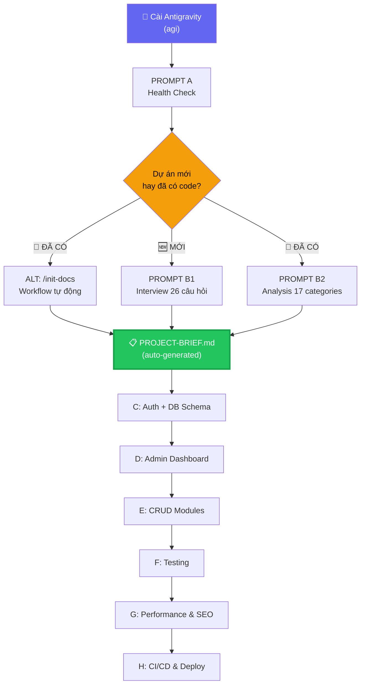

# 🚀 Antigravity-Core: Hướng dẫn Toàn diện — Từ Cài đặt đến Production

> **Version:** 5.0.0 PLATINUM+ | **Engine:** v5.0.0+ | **Ngày:** 2026-03-10
> **Áp dụng:** Mọi tech stack — Next.js, Laravel, NestJS, Vue/Nuxt, Django, v.v.
> **Đặc điểm:** Zero-Placeholder — Prompts C-H tự đọc context, chỉ cần Copy → Paste.
> ⏱️ **Tổng thời gian:** 4-6 giờ (chạy đầy đủ A → H) | Mỗi prompt chạy trong 1 conversation riêng.
>
> 📖 Xem thêm `documentation-blueprint.md` để hiểu toàn cảnh 20 loại tài liệu trong hệ sinh thái Antigravity.

---

## 📑 Mục lục

- [Cách hoạt động](#cách-hoạt-động)
- [Tổng quan Lộ trình](#tổng-quan-lộ-trình)
- **PHẦN 1 — STABILIZE**
  - [Prompt A: Health Check](#prompt-a-health-check)
- **PHẦN 2 — CONTEXTUALIZE** (chọn 1)
  - [Prompt B1: New Project Interview](#prompt-b1-new-project-interview)
  - [Prompt B2: Existing Project Analysis](#prompt-b2-existing-project-analysis)
- **PHẦN 3 — EXECUTE** (copy-paste, zero-placeholder)
  - [Prompt C: Database Schema & Auth](#prompt-c-database-schema--auth-hardening)
  - [Prompt D: Admin Dashboard](#prompt-d-admin-dashboard-build)
  - [Prompt E: CRUD Modules](#prompt-e-crud-modules)
  - [Prompt F: Testing Foundation](#prompt-f-testing-foundation)
  - [Prompt G: Performance & SEO](#prompt-g-performance--seo)
  - [Prompt H: CI/CD & Deploy](#prompt-h-cicd--deployment)
- [Quick Reference Card](#quick-reference-card)
- [Phụ lục](#phụ-lục)

---

## 📐 Cách hoạt động

```
Bước B (Interview/Analysis) tạo ra → docs/PROJECT-BRIEF.md
                                      ↓
Tất cả prompts C-H đều ghi: "Đọc docs/PROJECT-BRIEF.md"
                                      ↓
AI TỰ ĐỘNG biết: tên dự án, tech stack, database, roles, entities...
                                      ↓
BẠN CHỈ VIỆC: Copy prompt → Paste → Done ✅
```

> **Từ khóa `Xacnhan`:** Gõ bất cứ lúc nào để skip câu hỏi AI → auto-chọn phương án tốt nhất.

---

## 🗺️ Tổng quan Lộ trình



| Phase | Prompt | Thời gian | Input cần thiết |
|:------|:-------|:----------|:----------------|
| **Stabilize** | A: Health Check | ~1 phút | Không |
| **Contextualize** | B1 hoặc B2 (hoặc `/init-docs`) | 15-30 phút | B1: Trả lời câu hỏi · B2: Chỉ paste · `/init-docs`: Auto |
| **Execute** | C: Auth + DB Schema | 30-45 phút | ⚡ Copy-paste |
| | D: Admin Dashboard | 1-2 giờ | ⚡ Copy-paste |
| | E: CRUD Modules | 1-2 giờ | ⚡ Copy-paste |
| **Harden** | F: Testing | 45-60 phút | ⚡ Copy-paste |
| | G: Performance & SEO | 30-45 phút | ⚡ Copy-paste |
| | H: CI/CD & Deploy | 30-45 phút | ⚡ Copy-paste |

### Khi nào bỏ qua prompt?

| Loại dự án | Bỏ qua | Lý do |
|:-----------|:-------|:------|
| **API-only** (không UI) | D, G(SEO) | Không có frontend |
| **Static site / Blog** | C, D, E | Không có auth/admin/CRUD |
| **Backend microservice** | D, E, G(SEO) | Chỉ cần API + Auth + Deploy |
| **Admin-only** (no public) | G(SEO) | Không cần SEO |
| **Prototype / MVP nhanh** | F, G, H | Focus feature trước, hardening sau |

### Quick Reference Card

| Prompt | Làm gì | Output chính | Workflow |
|:-------|:-------|:------------|:---------|
| **A** | Health Check | Pass/Fail report | — |
| **B1** | Interview 26 câu | BRIEF + PLAN + CONVENTIONS | — |
| **B2** | Scan 17 categories | BRIEF + PLAN + CONVENTIONS | `/init-docs` |
| **C** | DB Schema + Auth | Migrations + Security audit | `/enhance` |
| **D** | Admin Dashboard | Shell + Widgets + Components | `/create-admin` |
| **E** | CRUD Modules | List/Create/Edit/Delete per entity | `/scaffold` |
| **F** | Testing | Unit + Integration + E2E | `/test` |
| **G** | Performance + SEO | Optimized config + CWV baseline | `/optimize` |
| **H** | CI/CD + Deploy | Pipeline + Docker + Runbook | `/deploy` |

---

═══════════════════════════════════════════════════════════
# PHẦN 1: STABILIZE
═══════════════════════════════════════════════════════════

## PROMPT A: HEALTH CHECK
**Xác nhận Antigravity-Core engine hoạt động bình thường**

**Thời gian:** ~1 phút | **Input:** Không | **Khi nào:** Ngay sau `agi`

### 🔥 COPY PROMPT:

---

Với vai trò là DevOps Engineer, chạy health check cho Antigravity-Core engine vừa cài đặt.

NHIỆM VỤ: Kiểm tra toàn bộ hệ thống .agent/ theo tiêu chuẩn Platinum.

Chạy script: .\.agent\scripts\health-check.ps1
(Alias: ag-hc — nếu đã cài global bằng install-global.ps1)

Nếu script không tồn tại hoặc có lỗi, kiểm tra thủ công:
- Đọc .agent/VERSION → xác nhận version (expected: 5.0.0)
- Đọc .agent/project.json → lấy expected component counts
- Đếm thực tế và so sánh:
  Agents: 27 | Skills: 62 | Workflows: 35 | Pipelines: 6 | Rules: 110 | Systems: 6
- Xác nhận core files tồn tại: GEMINI.md, ARCHITECTURE.md, project.json, VERSION, reference-catalog.md
- Kiểm tra 6 Pipeline Chains trong .agent/pipelines/ (BUILD, ENHANCE, FIX, IMPROVE, SHIP, REVIEW)
- Kiểm tra 6 Core Systems trong .agent/systems/

Nếu counts không khớp hoặc file thiếu → liệt kê cụ thể file/folder nào thiếu.

OUTPUT: Bảng tổng kết component counts (Expected vs Actual) + Pass/Fail status.

✅ DONE KHI:
- [ ] Version xác nhận (5.0.0)
- [ ] Component counts khớp (6 categories)
- [ ] Core files tồn tại (5 files)
- [ ] 6 Pipelines + 6 Systems present

---

═══════════════════════════════════════════════════════════
# PHẦN 2: CONTEXTUALIZE (Chọn 1 trong 2)
═══════════════════════════════════════════════════════════

> **B1** → dự án MỚI chưa có code | **B2** → dự án ĐÃ CÓ code
> **Kết quả:** Cả 2 đều tạo `docs/PROJECT-BRIEF.md` — file "chìa khóa" để prompts C-H hoạt động tự động.

---

## PROMPT B1: NEW PROJECT INTERVIEW
**Phỏng vấn 26 câu hỏi → Tạo bộ tài liệu nền tảng cho dự án mới**

**Thời gian:** 20-30 phút | **Input:** Trả lời câu hỏi
**Output:** `docs/PROJECT-BRIEF.md`, `docs/PLAN.md`, `docs/CONVENTIONS.md`, `tasks/todo.md`, `tasks/lessons.md` + setup commands

### 🔥 COPY PROMPT:

---

Với vai trò là chuyên gia cao cấp/ hội đồng chuyên gia cao cấp hàng đầu phù hợp, tốt nhất, năng lực chuyên môn mạnh nhất.

CONTEXT: Tôi muốn tạo DỰ ÁN MỚI từ đầu, sử dụng hệ thống .agent v5.0.

YOUR ROLE: Bạn là Senior Solution Architect + Product Consultant + UX Strategist. Nhiệm vụ:
- HỎI tôi 26 câu hỏi có mục tiêu (7 nhóm) để hiểu yêu cầu
- ĐỀ XUẤT tech stack tối ưu (so sánh 2-3 options với pros/cons)
- TẠO bộ tài liệu PROJECT hoàn chỉnh
- CUNG CẤP lệnh setup cho stack đã chọn

QUY TẮC HỎI: Hỏi từng nhóm, đợi trả lời rồi mới hỏi nhóm tiếp. Nếu user trả lời ngắn hoặc bỏ qua câu nào → tự đề xuất giá trị mặc định hợp lý dựa trên context đã thu thập, đánh dấu rõ [DEFAULT] để user biết.

━━━━━━━━━━━━━━━━━━━━━━━━━━━━━━━━━━━━━━━━━━━━━━━━

NHÓM 1: BỐI CẢNH KINH DOANH (5 câu hỏi)

Hỏi tôi lần lượt:
- Dự án giải quyết vấn đề gì? Người dùng cuối là ai?
- Giá trị cốt lõi — điều product PHẢI làm xuất sắc?
- KPIs — đo lường thành công bằng gì?
- Timeline — khi nào cần v1.0? (hard deadline hay flexible?)
- Team — bao nhiêu dev? Quen tech gì?

[ĐỢI trả lời Nhóm 1 trước khi hỏi Nhóm 2]

━━━━━━━━━━━━━━━━━━━━━━━━━━━━━━━━━━━━━━━━━━━━━━━━

NHÓM 2: YÊU CẦU KỸ THUẬT (7 câu hỏi)

- 5-10 tính năng MUST-HAVE cho v1.0?
- User flow — hành trình người dùng điển hình?
- Authentication — Email/password? Social login? MFA?
- Data model — entities chính? (User, Product, Order...)
- Real-time — chat, notifications, live dashboard?
- File upload — loại file, max size, storage?
- Third-party APIs — Stripe, SendGrid, OpenAI, Maps?

[ĐỢI trả lời Nhóm 2 trước khi hỏi Nhóm 3]

━━━━━━━━━━━━━━━━━━━━━━━━━━━━━━━━━━━━━━━━━━━━━━━━

NHÓM 3: QUY MÔ & HIỆU SUẤT (4 câu hỏi)

- Số users/ngày: launch? 6 tháng? 1 năm?
- Data volume: Small <1GB, Medium <100GB, Large <1TB?
- Geographic: Global hay regional? Cần CDN?
- Performance: LCP target? (<500ms, <1s, <3s?)

[ĐỢI trả lời Nhóm 3 trước khi hỏi Nhóm 4]

━━━━━━━━━━━━━━━━━━━━━━━━━━━━━━━━━━━━━━━━━━━━━━━━

NHÓM 4: HẠ TẦNG & NGÂN SÁCH (3 câu hỏi)

- Hosting: AWS/GCP/Azure? Serverless? VPS? PaaS?
- Budget hạ tầng/tháng: $0-50? $50-200? $200-500? $500+?
- Team expertise: Quen tech gì nhất? Muốn tránh tech nào?

[ĐỢI trả lời Nhóm 4 trước khi hỏi Nhóm 5]

━━━━━━━━━━━━━━━━━━━━━━━━━━━━━━━━━━━━━━━━━━━━━━━━

NHÓM 5: THIẾT KẾ & UX (3 câu hỏi)

- Visual style: Modern/minimal? Bold/vibrant? Corporate? Có web tham khảo?
- Platform: Web only? Mobile responsive? Native app? PWA?
- UX requirements: Dark mode? i18n? WCAG accessibility? Offline?

[ĐỢI trả lời Nhóm 5 trước khi hỏi Nhóm 6]

━━━━━━━━━━━━━━━━━━━━━━━━━━━━━━━━━━━━━━━━━━━━━━━━

NHÓM 6: BẢO MẬT & COMPLIANCE (2 câu hỏi)

- Compliance: GDPR? HIPAA? SOC 2? PCI-DSS? Dữ liệu nhạy cảm?
- Security level: Standard hay enhanced? (2FA bắt buộc, audit log, IP whitelist?)

[ĐỢI trả lời Nhóm 6 trước khi hỏi Nhóm 7]

━━━━━━━━━━━━━━━━━━━━━━━━━━━━━━━━━━━━━━━━━━━━━━━━

NHÓM 7: TƯƠNG LAI & ĐẶC BIỆT (2 câu hỏi)

- Features v2.0 — sau MVP sẽ thêm gì?
- Yêu cầu đặc biệt? (AI/ML, WebSocket, background jobs, cron, webhooks, SEO critical?)

[ĐỢI tất cả câu trả lời, rồi tiếp tục]

━━━━━━━━━━━━━━━━━━━━━━━━━━━━━━━━━━━━━━━━━━━━━━━━

SAU KHI CÓ 26 CÂU TRẢ LỜI:

BƯỚC 1: So sánh Tech Stack theo bảng:

| Layer | Option A | Option B | Option C |
|-------|----------|----------|----------|
| Backend | Laravel 12 + PHP 8.4 | Next.js 16 API Routes | Django 5 + Python 3.12 |
| Frontend | React 19 + Inertia.js | Next.js 16 (App Router) | Vue 3 + Nuxt 4 |
| Database | PostgreSQL 17 | PostgreSQL 17 | PostgreSQL 17 |
| Auth | Laravel Sanctum | Auth.js v5 | Django Auth |
| Deployment | Docker + VPS | Vercel | Docker + VPS |

Mỗi option: ✅ Pros (3-5) · ❌ Cons (2-3) · 💰 Chi phí/tháng · ⏱️ Thời gian MVP

BƯỚC 2: Đề xuất CLEAR RECOMMENDATION với lý do
BƯỚC 3: Tạo docs/PROJECT-BRIEF.md
BƯỚC 4: Tạo docs/PLAN.md (MVP Scope, Architecture, DB Schema, Tech Decisions, Milestones)
BƯỚC 5: Tạo docs/CONVENTIONS.md (Naming, code patterns, git, testing, API conventions)
BƯỚC 6: Tạo tasks/todo.md + tasks/lessons.md
BƯỚC 7: Cung cấp lệnh setup copy-paste cho stack đã chọn:

Next.js 16:
  pnpm dlx create-next-app@latest ./ --ts --tailwind --eslint --app --turbopack --use-pnpm
  agi

Laravel 12 + React:
  composer create-project laravel/laravel .
  composer require inertiajs/inertia-laravel
  agi

Django 5 + React:
  python -m venv venv && venv\Scripts\activate
  pip install django djangorestframework
  django-admin startproject core .
  agi

React Native (Expo):
  npx create-expo-app@latest . --template blank-typescript
  agi

Nếu `agi` chưa cài: irm "https://raw.githubusercontent.com/tuyenht/Antigravity-Core/main/.agent/scripts/install-global.ps1" | iex

QUAN TRỌNG — docs/PROJECT-BRIEF.md PHẢI chứa đầy đủ các mục sau (vì tất cả prompt tiếp theo sẽ đọc tự động):
- Project Name + Business Context + Vision
- Technical Stack (bảng: framework, language, database, ORM, auth, build tool, package manager, infra)
- Architecture Overview (directory tree)
- Data Model (tất cả entities + fields + relationships)
- Database Schema (tables, indexes, constraints)
- Roles & Permissions (danh sách roles + quyền)
- Admin prefix route
- Deploy target + Infra
- Design system preference
- i18n requirements (ngôn ngữ hỗ trợ, nếu có)
- Current State & Next Steps
Cuối file ghi: <!-- antigravity-brief: v1.0 -->

VALIDATION:
- 26/26 câu hỏi đã trả lời (hoặc đánh dấu [DEFAULT])
- Tech comparison hoàn chỉnh, có recommendation rõ ràng
- docs/PROJECT-BRIEF.md không có [TBD], đầy đủ tất cả fields
- Lệnh setup chạy được (copy-paste trực tiếp)

✅ DONE KHI: 5 files đã tạo + lệnh setup cung cấp + user xác nhận tech stack.

---

<br/>

## PROMPT B2: EXISTING PROJECT ANALYSIS
**Quét 17 categories → Tạo bộ tài liệu toàn diện cho dự án có sẵn**

**Thời gian:** 15-25 phút | **Input:** Chỉ paste (AI tự quét codebase)
**Output:** `docs/PROJECT-BRIEF.md`, `docs/PLAN.md`, `docs/CONVENTIONS.md`, `tasks/todo.md`, `tasks/lessons.md`

### 🔥 COPY PROMPT:

---

Với vai trò là chuyên gia cao cấp/ hội đồng chuyên gia cao cấp hàng đầu phù hợp, tốt nhất, năng lực chuyên môn mạnh nhất.

CONTEXT: Tôi có DỰ ÁN ĐÃ TỒN TẠI cần phân tích toàn diện và tích hợp với hệ thống .agent v5.0.

YOUR ROLE: Bạn là elite team Senior Technical Architects (Backend, Frontend, DevOps, Database, Security, Performance). Nhiệm vụ:
- PHÂN TÍCH codebase toàn diện (17 categories)
- TRÍCH XUẤT tất cả thông tin
- TẠO docs/PROJECT-BRIEF.md + docs/PLAN.md + docs/CONVENTIONS.md
- ĐỀ XUẤT cải thiện

━━━━━━━━━━━━━━━━━━━━━━━━━━━━━━━━━━━━━━━━━━━━━━━━

17 CATEGORIES CẦN PHÂN TÍCH:

1. TECH STACK DETECTION — Đọc config files, xác định language, framework, database, ORM, auth, build tool, infra, CI/CD

2. ROUTES & API ENDPOINTS — Đếm routes, auth-protected vs public, API versioning, middleware

3. CONTROLLERS / HANDLERS — Đếm controllers, flag fat controllers (>300 lines), validation, error handling

4. MODELS / DATA LAYER — Đếm models, map relationships, scopes, soft deletes, observers

5. DATABASE MIGRATIONS & SCHEMA — Map tables, indexes, FKs, tìm missing indexes, seed data

6. FRONTEND ARCHITECTURE — Components, state management, routing, styling, responsive, a11y, bundle size

7. CONFIGURATION & ENVIRONMENT — .env.example, secrets, config per env, feature flags

8. SERVICES & BUSINESS LOGIC — Service layer pattern, DI, external APIs, error handling

9. TESTS & COVERAGE — Đếm tests (unit/integration/E2E), coverage %, missing tests

10. DOCUMENTATION QUALITY — README, API docs, inline docs, architecture diagrams

11. CODE QUALITY & STANDARDS — Linting, formatting, git hooks, dead code, TODO/FIXME count

12. SECURITY POSTURE — Auth, RBAC, input validation, XSS, CSRF, dependencies, secrets, rate limiting

13. GIT HISTORY & TEAM — Contributors, commit frequency, code churn hotspots

14. PERFORMANCE PROFILING — N+1 queries, missing indexes, large payloads, caching gaps

15. DEPENDENCY GRAPH — Circular dependencies, god classes, unused/outdated packages

16. CODE COMPLEXITY HEATMAP — Files >500 lines RED, 300-500 YELLOW, <300 GREEN

17. API TESTING STRATEGY — Endpoint coverage, error scenarios, security testing

━━━━━━━━━━━━━━━━━━━━━━━━━━━━━━━━━━━━━━━━━━━━━━━━

OUTPUT FORMAT MẪu (cho 3 categories quan trọng nhất):

Category 1 — Tech Stack:
  Language: TypeScript 5.4 (Node.js 20 LTS)
  Framework: Next.js 15.1 (App Router)
  Database: PostgreSQL 16.2
  ORM: Prisma 6.1
  Auth: Auth.js v5 (Google + GitHub OAuth)
  API: REST + Server Actions
  Build: Turbopack (dev) / Webpack (prod)
  Package Manager: pnpm 9.x
  Infra: Docker + Vercel (production)

Category 12 — Security:
  Auth: bcrypt hashing ✅, session-based ✅
  Authorization: RBAC with policies ✅
  Input validation: ✅ All forms validated
  XSS: ✅ Output escaping active
  Dependencies: ⚠️ 2 moderate vulnerabilities
  Rate limiting: ⚠️ Only on login
  Score: 8/10

Category 14 — Performance:
  N+1 Queries: 3 hotspots found
  Missing indexes: posts.user_id, orders.status
  Large payloads: /api/products returns ALL without pagination
  Caching: Redis configured but only used for sessions
  Estimated improvement: 40-60% faster with fixes

Category 6 — Frontend:
  Components: 67 (feature-based ✅)
  State: Zustand (3 stores: auth, cart, ui)
  Styling: Tailwind CSS v4 ✅
  Responsive: Mobile-first ✅ (3 breakpoints)
  A11y: Partial ⚠️
  Bundle: 245KB gzipped

Category 9 — Tests:
  Total: 87 (Unit: 52, Integration: 28, E2E: 7)
  Coverage: 68% ⚠️ (target: 80%)
  Well-tested: Auth ✅, Payments ✅
  Undertested: Admin panel ❌, File uploads ❌

Category 11 — Code Quality:
  Linting: ESLint strict ✅ (148 rules)
  Formatting: Prettier ✅
  Git hooks: Husky + lint-staged ✅
  Dead code: 12 unused imports ⚠️
  Tech debt: 18 TODO, 4 FIXME, 2 HACK
  Score: 8/10

━━━━━━━━━━━━━━━━━━━━━━━━━━━━━━━━━━━━━━━━━━━━━━━━

THỨ TỰ THỰC HIỆN:

0. DOCS INGESTION — SMART CONDITIONAL CHAIN:
   Quét docs/ folder → đếm .md files + kiểm tra stamp:

   ┌─ docs/ KHÔNG tồn tại hoặc rỗng
   │  → SKIP (dự án mới, B2 tạo từ codebase analysis)
   │
   ├─ docs/ có ≤5 files
   │  → B2 TỰ XỬ LÝ NỘI BỘ (đọc, phân loại, merge — nhanh)
   │
   ├─ docs/ có >5 files + CHƯA có stamp <!-- antigravity: v1.0 -->
   │  → ⚡ AUTO-CHAIN: Gọi /init-docs TRƯỚC (standardize all)
   │  → Sau khi /init-docs xong → B2 tiếp tục với docs đã chuẩn
   │
   └─ docs/ có stamp
      → SKIP ingestion (đọc files chuẩn trực tiếp)

1. READ directory structure (tree / file list)
2. SCAN config files → Category 1 (Tech Stack)
3. ANALYZE Categories 2-12 (routes → security)
4. RUN git commands → Category 13
5. PROFILE Categories 14-17 (performance → API testing)
6. SYNTHESIZE all findings + docs ingestion data → tạo output files
7. VALIDATE → không gaps, không placeholders

━━━━━━━━━━━━━━━━━━━━━━━━━━━━━━━━━━━━━━━━━━━━━━━━

OUTPUT — TẠO 5 FILES:

FILE 1: docs/PROJECT-BRIEF.md (QUAN TRỌNG NHẤT)
PHẢI chứa đầy đủ để các prompt sau đọc tự động:
- Project Name + Business Context + Vision
- Technical Stack (bảng: framework, language, database, ORM, auth, build tool, package manager, infra)
- Architecture Overview (directory tree)
- Data Model (tất cả entities + fields + relationships)
- Database Schema (tables, indexes, constraints)
- Roles & Permissions (danh sách roles hiện có)
- Admin prefix route
- Deploy target / Infra hiện tại
- Design system (nếu có)
- i18n status (ngôn ngữ hỗ trợ, nếu có)
- Current State & Maturity (✅/🔄/⬜)
- Technical Debt & Risks (bảng ưu tiên)
- Recommended Next Steps (top 5-8)
Cuối file ghi: <!-- antigravity-brief: v1.0 -->

FILE 2: docs/PLAN.md — MVP Scope, Milestones, Roadmap
FILE 3: docs/CONVENTIONS.md — Naming, code patterns, git, testing, API conventions
FILE 4: tasks/todo.md — Prioritized action items
FILE 5: tasks/lessons.md — Template

━━━━━━━━━━━━━━━━━━━━━━━━━━━━━━━━━━━━━━━━━━━━━━━━

VALIDATION:
- 17/17 categories analyzed với DỮ LIỆU THẬT
- docs/PROJECT-BRIEF.md đầy đủ tất cả fields nêu trên
- Không placeholder, không [TBD]
- Security findings flagged with severity
- Performance improvements quantified

✅ DONE KHI: 5 files đã tạo + 17/17 categories có dữ liệu thật + bảng tổng kết maturity.

---

═══════════════════════════════════════════════════════════
# PHẦN 3: EXECUTE (Zero-Placeholder — Chỉ Copy & Paste)
═══════════════════════════════════════════════════════════

> Từ đây trở đi, **KHÔNG CẦN** thay bất kỳ placeholder nào.
> Mỗi prompt tự đọc `docs/PROJECT-BRIEF.md` để lấy context.
> **Bạn chỉ việc: Copy → Paste → Done.**
>
> ⚠️ **Nếu prompt báo "không tìm thấy PROJECT-BRIEF.md":** Bạn chưa chạy Prompt B. Quay lại chạy B1 hoặc B2 trước.

---

## PROMPT C: DATABASE SCHEMA & AUTH HARDENING
**Thiết lập database schema + bảo mật authentication theo OWASP**

**Thời gian:** 30-45 phút | **Workflow:** `/enhance` | **Input:** Không — AI tự đọc

### 🔥 COPY PROMPT:

---

Với vai trò là Security Architect + Database Expert + Backend Specialist, thiết lập database schema và hoàn thiện authentication cho dự án hiện tại.

AUTO-CONTEXT: Đọc docs/PROJECT-BRIEF.md để xác định tên dự án, tech stack, database type, ORM, data model (entities + fields + relationships), auth framework, danh sách roles, và trạng thái hiện tại. Sau đó quét docs/ folder: nếu tìm thấy SCHEMA.md, SECURITY.md → đọc bổ sung context chuyên sâu. Cuối cùng tự quét codebase để tìm schema files, migrations, auth config, middleware. Nếu PROJECT-BRIEF.md không tồn tại → dừng lại và yêu cầu user chạy Prompt B trước. Nếu tìm thấy CONTEXT-MANIFEST.md → đọc để biết files nào cần quét thêm.

━━━━━━━━━━━━━━━━━━━━━━━━━━━━━━━━━━━━━━━━━━━━━━━━

BƯỚC 1: DATABASE SCHEMA SETUP

Đọc data model từ PROJECT-BRIEF.md, sau đó:
- Tạo/xác minh database schema (Prisma schema / migrations / SQL — tùy ORM)
- Thiết lập tất cả tables, columns, types, constraints
- Tạo indexes cho FKs và frequently-queried columns
- Thiết lập relationships (1-1, 1-N, N-N)
- Tạo seed data / factory cho development
- Xác nhận database connection hoạt động
- Chạy migrations nếu cần

━━━━━━━━━━━━━━━━━━━━━━━━━━━━━━━━━━━━━━━━━━━━━━━━

BƯỚC 2: SECURITY AUDIT

Tự phát hiện và kiểm tra:
- Auth configuration file (auth.ts, auth.config.ts, config/auth.php, v.v.)
- Middleware/Guard protection patterns
- Session management (JWT vs Database vs Cookie)
- CSRF protection
- Password hashing (algorithm + rounds)
- Rate limiting trên login endpoint
- Secrets management (tìm hardcoded secrets, giá trị mặc định)

━━━━━━━━━━━━━━━━━━━━━━━━━━━━━━━━━━━━━━━━━━━━━━━━

BƯỚC 3: AUTH HARDENING

Triển khai các biện pháp còn thiếu:
- Forgot Password flow
- Account lockout sau 5 failed attempts
- Session invalidation khi đổi password
- Secure cookie settings (HttpOnly, SameSite, Secure)
- Environment variable validation (Zod / Joi / tương đương)
- 2FA preparation (optional)

━━━━━━━━━━━━━━━━━━━━━━━━━━━━━━━━━━━━━━━━━━━━━━━━

BƯỚC 4: RBAC VERIFICATION

Đọc danh sách roles từ PROJECT-BRIEF.md, sau đó xác minh:
- Route protection theo role
- API endpoint protection
- UI element visibility theo role (permission guards)

TIÊU CHUẨN: OWASP Authentication Cheat Sheet compliance.
OUTPUT: Database schema hoàn chỉnh + Security audit report + code changes.

✅ DONE KHI:
- [ ] Schema migrations chạy thành công
- [ ] Auth config secure (bcrypt/argon2 + ≥6 rounds)
- [ ] RBAC routes và API đều protected
- [ ] Seed data hoạt động
- [ ] Không hardcoded secrets

---

<br/>

## PROMPT D: ADMIN DASHBOARD BUILD
**Xây dựng Admin Dashboard hoàn chỉnh với component library**

**Thời gian:** 1-2 giờ | **Workflow:** `/create-admin` hoặc `/admin-dashboard` | **Input:** Không

### 🔥 COPY PROMPT:

---

Với vai trò là Senior Frontend Architect + UI/UX Expert, xây dựng Admin Dashboard cho dự án hiện tại.

AUTO-CONTEXT: Đọc docs/PROJECT-BRIEF.md để xác định: tech stack, admin prefix route, design system preference, data model (để biết cần dashboard widgets gì), i18n requirements. Quét docs/ folder: nếu tìm thấy PROJECT-SCREENS.md, I18N.md → đọc bổ sung. Nếu có skill Velzon trong .agent/skills/velzon-admin/SKILL.md thì đọc và áp dụng. Nếu PROJECT-BRIEF.md không tồn tại → dừng lại và yêu cầu user chạy Prompt B trước. Nếu tìm thấy CONTEXT-MANIFEST.md → đọc để biết files nào cần quét thêm.

━━━━━━━━━━━━━━━━━━━━━━━━━━━━━━━━━━━━━━━━━━━━━━━━

BƯỚC 1: ADMIN SHELL (Layout)

Triển khai khung giao diện:
- Header (logo, search, notifications dropdown, user menu, language switcher nếu i18n)
- Navigation Menu (horizontal hoặc vertical sidebar — chọn phù hợp với stack)
- Footer + Responsive layout + Theme switcher (light/dark)
- Breadcrumb component

━━━━━━━━━━━━━━━━━━━━━━━━━━━━━━━━━━━━━━━━━━━━━━━━

BƯỚC 2: DASHBOARD PAGE

Đọc data model từ PROJECT-BRIEF.md, tạo dashboard widgets phù hợp:
- Statistics cards (4-6 KPIs — tự chọn dựa trên entities trong data model)
- Chart widget (line/bar/doughnut — placeholder data)
- Recent activity feed
- Quick actions panel
- System health/status indicators

━━━━━━━━━━━━━━━━━━━━━━━━━━━━━━━━━━━━━━━━━━━━━━━━

BƯỚC 3: REUSABLE COMPONENT LIBRARY

Tạo bộ components dùng chung:
- DataTable (sortable, filterable, pagination)
- StatCard, ChartWidget, ActionDropdown, StatusBadge
- ConfirmDialog, Toast/Notification, Loading skeletons

━━━━━━━━━━━━━━━━━━━━━━━━━━━━━━━━━━━━━━━━━━━━━━━━

BƯỚC 4: i18n SETUP (nếu PROJECT-BRIEF.md yêu cầu đa ngôn ngữ)

- Cấu trúc locale files (vi, en, v.v.)
- Language switcher component
- Translation keys cho tất cả UI text
- Hydration-safe i18n (tránh mismatch SSR/CSR)

TIÊU CHUẨN: LCP < 1.5s, FID < 50ms, WCAG 2.1 AA, Mobile-first.
OUTPUT: Admin Dashboard hoạt động + component library + i18n (nếu áp dụng).

✅ DONE KHI:
- [ ] Dashboard render thành công
- [ ] Tất cả widgets hiển thị + responsive
- [ ] Theme switcher (light/dark) hoạt động
- [ ] i18n switch (nếu áp dụng)
- [ ] LCP < 1.5s trên admin

---

<br/>

## PROMPT E: CRUD MODULES
**Tạo các module quản lý CRUD từ data model**

**Thời gian:** 1-2 giờ | **Workflow:** `/scaffold` | **Input:** Không — AI tự đọc data model

### 🔥 COPY PROMPT:

---

Với vai trò là Full-stack Architect, tạo trọn bộ CRUD modules cho Admin Panel của dự án hiện tại.

AUTO-CONTEXT: Đọc docs/PROJECT-BRIEF.md để lấy danh sách entities, fields, relationships, admin prefix route, và tech stack. Quét docs/ folder: nếu tìm thấy PRD.md → đọc bổ sung acceptance criteria cho entities. Tạo CRUD module cho MỖI entity trong data model. Nếu PROJECT-BRIEF.md không tồn tại → dừng lại và yêu cầu user chạy Prompt B trước. Nếu tìm thấy CONTEXT-MANIFEST.md → đọc để biết files nào cần quét thêm.

━━━━━━━━━━━━━━━━━━━━━━━━━━━━━━━━━━━━━━━━━━━━━━━━

CHO MỖI ENTITY TRONG DATA MODEL, TẠO:

- List view (DataTable) với search, filter, sort, pagination
- Create form + Edit form (pre-populated) với validation
- Detail view với related entities
- Delete với confirmation + cascade warning
- Server-side mutations (Server Actions / API routes / Controllers — tùy stack)

━━━━━━━━━━━━━━━━━━━━━━━━━━━━━━━━━━━━━━━━━━━━━━━━

TIÊU CHUẨN KỸ THUẬT:

- Validation: Zod / Yup / Joi / Form Request (tùy stack, tự detect)
- Optimistic updates (nếu framework hỗ trợ)
- Error boundaries / Error handling cho mỗi module
- Loading states (skeleton screens)
- Bulk actions (select multiple → delete/export)
- RBAC: Ẩn/hiện nút theo role (đọc roles từ PROJECT-BRIEF.md)

OUTPUT: Tất cả CRUD modules + validation schemas + danh sách routes.

✅ DONE KHI:
- [ ] Mỗi entity có đủ List/Create/Edit/Detail/Delete
- [ ] Validation hoạt động (client + server)
- [ ] RBAC applied (ẩn/hiện nút theo role)
- [ ] Loading states + error handling

---

<br/>

## PROMPT F: TESTING FOUNDATION
**Thiết lập testing infrastructure + viết test suite ban đầu**

**Thời gian:** 45-60 phút | **Workflow:** `/test` | **Input:** Không

### 🔥 COPY PROMPT:

---

Với vai trò là Senior Test Engineer, thiết lập testing foundation cho dự án hiện tại.

AUTO-CONTEXT: Đọc docs/PROJECT-BRIEF.md để xác định tech stack, rồi chọn testing tools phù hợp. Quét docs/ folder: nếu tìm thấy TESTING-STRATEGY.md → đọc bổ sung test plan. Quét codebase để xác định có test nào chưa. Nếu PROJECT-BRIEF.md không tồn tại → dừng lại và yêu cầu user chạy Prompt B trước. Nếu tìm thấy CONTEXT-MANIFEST.md → đọc để biết files nào cần quét thêm.

━━━━━━━━━━━━━━━━━━━━━━━━━━━━━━━━━━━━━━━━━━━━━━━━

BƯỚC 1: INFRASTRUCTURE SETUP

Tự chọn tools phù hợp với tech stack:
- Unit: Vitest (Vite/Next.js), Jest (React), PHPUnit (Laravel), pytest (Python)
- E2E: Playwright
- Component: Testing Library
- Mocking: MSW / Factory pattern / Mockery
- Scripts: test, test:unit, test:e2e, test:coverage

━━━━━━━━━━━━━━━━━━━━━━━━━━━━━━━━━━━━━━━━━━━━━━━━

BƯỚC 2: UNIT TESTS

Quét src/ để tìm và viết tests cho:
- Auth utilities (session, role checking, token)
- Business logic, Validation schemas
- Data access layer / API helpers
- Utility functions
- Target: 80% coverage

━━━━━━━━━━━━━━━━━━━━━━━━━━━━━━━━━━━━━━━━━━━━━━━━

BƯỚC 3: INTEGRATION TESTS

- Auth flow (login → session → protected route → logout)
- CRUD operations cho entity chính
- Middleware / Guard protection
- API endpoint contracts

━━━━━━━━━━━━━━━━━━━━━━━━━━━━━━━━━━━━━━━━━━━━━━━━

BƯỚC 4: E2E TESTS (Playwright)

- Login → Dashboard → Logout
- CRUD workflow cho entity chính
- Role-based UI visibility
- Error handling (wrong password, validation failures)

TIÊU CHUẨN: AAA Pattern, no flaky tests, deterministic data.
OUTPUT: Testing infrastructure + test suite + coverage report.

✅ DONE KHI:
- [ ] `pnpm test` pass + coverage ≥ 80%
- [ ] E2E login flow pass
- [ ] Auth + CRUD + Guard tests green
- [ ] CI có thể chạy test suite

---

<br/>

## PROMPT G: PERFORMANCE & SEO
**Tối ưu performance + triển khai SEO cho public pages**

**Thời gian:** 30-45 phút | **Workflow:** `/optimize` | **Input:** Không

### 🔥 COPY PROMPT:

---

Với vai trò là Performance Engineer + SEO Specialist, tối ưu dự án hiện tại.

AUTO-CONTEXT: Đọc docs/PROJECT-BRIEF.md để xác định framework, rồi quét config files hiện tại (next.config.*, vite.config.*, webpack.config.*, v.v.) để đánh giá trạng thái. Quét docs/ folder: nếu tìm thấy PERFORMANCE.md → đọc bổ sung performance budgets. Nếu PROJECT-BRIEF.md không tồn tại → dừng lại và yêu cầu user chạy Prompt B trước. Nếu tìm thấy CONTEXT-MANIFEST.md → đọc để biết files nào cần quét thêm.

━━━━━━━━━━━━━━━━━━━━━━━━━━━━━━━━━━━━━━━━━━━━━━━━

BƯỚC 1: FRAMEWORK CONFIG OPTIMIZATION

Tối ưu config file chính:
- Build output (standalone / tree shaking)
- Image/Asset optimization
- Security headers (CSP, HSTS, X-Frame-Options)
- Compression + Bundle analysis

━━━━━━━━━━━━━━━━━━━━━━━━━━━━━━━━━━━━━━━━━━━━━━━━

BƯỚC 2: CACHING STRATEGY

- Page-level: Static generation / ISR / CDN (tùy framework)
- Data-level: In-memory, Redis, query caching
- API-level: Cache-Control, ETag
- Asset-level: Long-term caching + content hashing

━━━━━━━━━━━━━━━━━━━━━━━━━━━━━━━━━━━━━━━━━━━━━━━━

BƯỚC 3: SEO (nếu dự án có public pages — tự detect)

- JSON-LD structured data
- Dynamic metadata per page
- Canonical URLs + Open Graph + Twitter Cards
- robots.txt + sitemap.xml

━━━━━━━━━━━━━━━━━━━━━━━━━━━━━━━━━━━━━━━━━━━━━━━━

BƯỚC 4: CORE WEB VITALS

Target: LCP < 2.5s (public) / < 1.5s (admin), FID < 100ms, CLS < 0.1, INP < 200ms
Áp dụng: Font preload, critical CSS, lazy loading, code splitting.

OUTPUT: Optimized configs + performance baseline + SEO checklist.

✅ DONE KHI:
- [ ] Build thành công + bundle size giảm
- [ ] Security headers set (CSP, HSTS, X-Frame)
- [ ] SEO meta verified (JSON-LD, OG, sitemap)
- [ ] CWV targets: LCP < 2.5s, CLS < 0.1, INP < 200ms

---

<br/>

## PROMPT H: CI/CD & DEPLOYMENT
**Thiết lập pipeline CI/CD + production deployment**

**Thời gian:** 30-45 phút | **Workflow:** `/deploy` | **Input:** Không

### 🔥 COPY PROMPT:

---

Với vai trò là DevOps Architect, thiết lập CI/CD pipeline và production deployment cho dự án hiện tại.

AUTO-CONTEXT: Đọc docs/PROJECT-BRIEF.md để xác định deploy target, tech stack. Quét docs/ folder: nếu tìm thấy DEPLOYMENT.md → đọc bổ sung runbook hiện có. Quét Dockerfile, docker-compose.yml, .github/workflows/ nếu đã có. Nếu PROJECT-BRIEF.md không tồn tại → dừng lại và yêu cầu user chạy Prompt B trước. Nếu tìm thấy CONTEXT-MANIFEST.md → đọc để biết files nào cần quét thêm.

━━━━━━━━━━━━━━━━━━━━━━━━━━━━━━━━━━━━━━━━━━━━━━━━

BƯỚC 1: CONTAINERIZATION (nếu dùng Docker — tự detect)

- Multi-stage build (deps → build → production)
- Minimal image (alpine / distroless) + Non-root user
- Health check endpoint + Layer caching
- docker-compose cho local dev

━━━━━━━━━━━━━━━━━━━━━━━━━━━━━━━━━━━━━━━━━━━━━━━━

BƯỚC 2: CI/CD PIPELINE

Tạo pipeline phù hợp (GitHub Actions / GitLab CI — tự detect từ .git config):
- CI: Lint → Type Check → Unit Tests → Build (on PR)
- CD: Build → Push Image → Deploy (on main merge)
- Security: Dependency audit + Secret scanning (weekly)

━━━━━━━━━━━━━━━━━━━━━━━━━━━━━━━━━━━━━━━━━━━━━━━━

BƯỚC 3: ENVIRONMENT MANAGEMENT

- .env.example đầy đủ (có comments)
- Runtime env validation (Zod / tương đương)
- Secrets management cho production
- Configs: development → staging → production

━━━━━━━━━━━━━━━━━━━━━━━━━━━━━━━━━━━━━━━━━━━━━━━━

BƯỚC 4: PRODUCTION CHECKLIST

Tạo docs/DEPLOYMENT.md:
- Pre-deploy checklist (10+ items)
- Rollback procedure (step-by-step)
- Monitoring endpoints + alerting
- Database migration strategy
- Backup automation + Post-deploy verification

TIÊU CHUẨN: Zero-downtime, automated rollback, 99.9% uptime.
OUTPUT: Docker setup + CI/CD pipelines + Deployment docs.

✅ DONE KHI:
- [ ] CI pipeline pass (PR test)
- [ ] Docker build thành công
- [ ] docs/DEPLOYMENT.md tạo xong
- [ ] Rollback procedure documented

---

## 📚 PHỤ LỤC

### Slash Commands thường dùng

| Tình huống | Command | Mô tả |
|:-----------|:--------|:------|
| Chuẩn hóa docs (1 lần) | `/init-docs` | Scan → Classify → Generate → Archive legacy |
| Lỗi nhỏ, fix nhanh | `/quickfix` | Sửa chớp nhoáng |
| Bug phức tạp | `/debug` | Phân tích root cause |
| Thêm tính năng | `/enhance` | Thiết kế → Code → Test |
| Tạo CRUD module | `/scaffold` | Auto-generate full stack |
| Review code | `/check` | Quality gates toàn diện |
| Refactor | `/refactor` | Giảm tech debt |
| Tối ưu hiệu suất | `/optimize` | Profiling → Fix |
| Kiểm tra bảo mật | `/security-audit` | OWASP scan |
| Deploy | `/deploy` | Production release |
| UI/UX nâng cao | `/ui-ux-pro-max` | Design intelligence |
| Full team workflow | `/full-pipeline` | Chạy BA → SA → PM → DEV → QA → DO |

### Cách gọi Workflow với mô tả

```
/init-docs                           Chuẩn hóa toàn bộ docs dự án (chạy 1 lần)
/create-admin                        Xây admin Next.js 16 + Velzon + Auth.js v5
/scaffold Product                    Tạo CRUD cho entity Product theo data model
/enhance search                      Thêm full-text search PostgreSQL
/fix login redirect                  Sửa lỗi redirect sau login
/requirements-first                  Thu thập yêu cầu chi tiết → PRD
```

### Pro Tips

> [!TIP]
> **Từ khóa `Xacnhan`:** Gõ bất cứ lúc nào để skip câu hỏi AI → tự động chọn phương án tối ưu nhất do chuyên gia đề xuất.

> [!TIP]
> **Mô tả càng chi tiết = Kết quả càng tốt:** Luôn kèm file paths cụ thể, error messages, tech stack khi viết prompt.

> [!NOTE]
> **Auto-detect rules:** Antigravity tự nhận diện `.tsx` → React + TypeScript rules, `.php` → Laravel rules, `.py` → Python rules. Không cần chỉ định thủ công.

> [!IMPORTANT]
> **1 prompt = 1 conversation mới:** Tối đa context window. Mỗi prompt nên chạy trong conversation riêng để AI có đủ bộ nhớ xử lý.

> [!NOTE]
> **Bỏ qua prompt không cần:** Xem bảng "Khi nào bỏ qua prompt?" ở đầu tài liệu để biết prompt nào không áp dụng cho loại dự án của bạn.

> [!TIP]
> **Phase 0 tự động:** Mỗi Pipeline có Phase 0 Bootstrap — hệ thống tự tạo docs nếu thiếu. Nhưng chạy Prompt B chủ động sẽ cho kết quả tốt hơn nhiều.

---

### Troubleshooting

| Vấn đề | Nguyên nhân | Giải pháp |
|:-------|:------------|:----------|
| Health check fail (counts sai) | Engine version mismatch | Chạy `agu` (update) rồi health check lại |
| PROJECT-BRIEF.md tạo thiếu fields | Prompt B trả lời quá ngắn | Chạy lại B, trả lời chi tiết hơn hoặc gõ `Xacnhan` để AI tự bổ sung |
| Prompt C-H không detect context | Chưa chạy Prompt B | **BẮT BUỘC** chạy Prompt B trước — nó tạo ra PROJECT-BRIEF.md |
| Prompt C-H detect sai thông tin | PROJECT-BRIEF.md outdated | Chạy lại Prompt B2 để cập nhật BRIEF |
| AI hỏi quá nhiều câu hỏi | Behaviour mặc định | Gõ `Xacnhan` để auto-proceed |
| Prompt quá dài, bị cắt | Context window limit | Paste prompt vào conversation MỚI (không chung với prompts trước) |
| File output ghi sai đường dẫn | AI không biết project root | Thêm 1 dòng vào prompt: "Project root: [đường dẫn]" |
| Database setup fail trong Prompt C | Thiếu .env config | Tạo .env từ .env.example, điền database connection trước khi chạy C |
| Prompt C-H thiếu context chuyên sâu | Chỉ đọc PROJECT-BRIEF.md | Chạy lại B2 hoặc tạo thêm Tier 2 docs (SCHEMA.md, PERFORMANCE.md...) |

---

> **Tạo bởi:** Antigravity Chief AI Solutions Architect
> **Version:** 5.0.0 PLATINUM+ | **Engine:** v5.0.0+ | **Audit:** Platinum Elevation 2026-03-10
> **Ngày:** 2026-03-10 | **License:** Internal use — Baoson Platform
