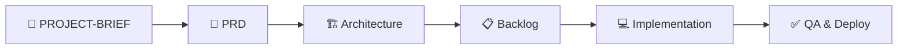

# 📋 Antigravity IDE — Blueprint Tài liệu Chuẩn cho Phần mềm Production-Ready

> **Version**: 3.0 · **Antigravity-Core**: v5.0.0 · **Ngày**: 2026-03-10
>
> Với tư cách là **Chief Software Architect**, đây là bản đồ toàn cảnh các tài liệu và artifact bạn cần chuẩn bị khi sử dụng Antigravity IDE để xây dựng một hệ thống phần mềm đạt **Platinum Standard (95/100+)**.
>
> 🔗 **Hướng dẫn thực thi từng bước:** Xem `antigravity-complete-project-guide.md` (cùng thư mục) để có prompts copy-paste cho mỗi Phase.

---

## 🎯 Tổng quan: Quy trình Documentation-First

Antigravity-Core vận hành theo triết lý **"Neural Bridge"**: tài liệu là cầu nối giữa ý tưởng và code. Chất lượng tài liệu quyết định **90% mức độ tự trị** của AI agent.



---

## 📦 Danh mục Tài liệu theo Phase

### Phase 0: Khởi tạo Hệ thống (Day 0)

| # | Tài liệu | Mô tả | Cách tạo |
|---|----------|--------|----------|
| 1 | **Antigravity-Core Engine** | Toàn bộ `.agent/` directory (roles, workflows, skills, memory) | Lệnh `agi` (alias) hoặc script `install-antigravity.ps1` hoặc copy từ [GitHub](https://github.com/tuyenht/Antigravity-Core) |
| 2 | **Health Check** | Xác minh engine hoạt động đúng (35 workflows, 62 skills, 27 agents) | `.\.agent\scripts\health-check.ps1` |

> [!TIP]
> **Cài đặt nhanh 2 bước**: ① `install-global.ps1` (1 lần duy nhất) → ② Gõ `agi` trong bất kỳ thư mục dự án nào.

---

### Phase 1: Khám phá & Phân tích (BA — Business Analyst)

| # | Tài liệu | Mô tả | Cách tạo |
|---|----------|--------|----------|
| 3 | **PROJECT-BRIEF.md** ⭐ | Single Source of Truth — mô tả toàn bộ dự án | Dùng **Prompt B1** (dự án mới), **Prompt B2** (dự án có sẵn), hoặc **`/init-docs`** |
| 4 | **CONVENTIONS.md** | Quy ước coding, naming, folder structure | Tự động sinh khi phân tích dự án có sẵn |
| 5 | **PRD.md** | Product Requirements Document — 9 mục bắt buộc: Overview, Tech Requirements, Tech Stack, Current State, Integration Strategy, Roadmap, Risk, Approval | Workflow `/requirements-first` |
| 6 | **user-stories.md** | User Stories chuẩn Given-When-Then | Workflow `/requirements-first` |
| 7 | **CONTEXT-MANIFEST.md** | Danh mục docs cho AI biết file nào tồn tại và mục đích | Workflow `/init-docs` tự động tạo |

---

### Phase 2: Kiến trúc Hệ thống (SA — Solution Architect)

| # | Tài liệu | Mô tả | Cách tạo |
|---|----------|--------|----------|
| 8 | **architecture.md** | System overview, components, data flow diagram | Workflow `/plan` hoặc `/schema-first` |
| 9 | **tech-decisions.md** | Architecture Decision Records (ADR) — lý do chọn từng công nghệ | SA role tự động sinh |
| 10 | **schema.sql** | Database schema chuẩn hóa (indexes, FK, comments) | Workflow `/schema-first` |

---

### Phase 3: Lên kế hoạch (PM — Project Manager)

| # | Tài liệu | Mô tả | Cách tạo |
|---|----------|--------|----------|
| 11 | **backlog.md** | Product backlog ưu tiên theo Sprint | Workflow `/plan` |
| 12 | **Sprint Plan** | Kế hoạch chi tiết từng sprint | PM role quản lý |

---

### Phase 4: Triển khai Code (DEV — Backend + Frontend)

| # | Tài liệu / Artifact | Mô tả | Tiêu chuẩn |
|---|---------------------|--------|-----------|
| 13 | **Source Code** (`src/`) | Toàn bộ Acceptance Criteria đã implement, không hardcoded secrets | ES2024+, strict typing |
| 14 | **Test Suites** (`tests/`) | Unit + Integration tests | Coverage ≥ 80% |
| 15 | **api-docs.md** | Tài liệu API với request/response examples | Mọi endpoint phải có docs |

---

### Phase 5: Triển khai & Vận hành (DO — DevOps)

| # | Tài liệu | Mô tả | Cách tạo |
|---|----------|--------|----------|
| 16 | **CI/CD Pipelines** (`.github/workflows/`) | GitHub Actions hoặc tương đương | DevOps role |
| 17 | **deploy.sh** | Script triển khai tự động | DevOps role |
| 18 | **deployment-runbook.md** | Hướng dẫn vận hành chi tiết | DevOps role |

---

### Phase 6: Chất lượng & Bảo trì (QA)

| # | Tài liệu / Cơ chế | Mô tả | Cách tạo |
|---|-------------------|--------|----------|
| 19 | **Quality Gates** | Lint sync (TSC, PHPStan), Test validation, Doc sync tự động | Tự động enforce qua CI pipeline |
| 20 | **CHANGELOG.md** | Ghi nhận mọi thay đổi theo Semantic Versioning | Mỗi lần release |
| 21 | **Shell Audit Report** | Đánh giá UI/UX fidelity (nếu có frontend) | Shell Audit Protocol v3.2+ |

---

## 🏗️ Cấu trúc Thư mục Chuẩn

Antigravity tự động sinh cấu trúc dự án theo chuẩn sau:

```
[project-name]/
├── 📂 .agent/          ← AI OS Engine (Roles, Workflows, Skills, Memory)
├── 📂 docs/            ← Project Source of Truth (3-tier taxonomy)
│   ├── PROJECT-BRIEF.md    ← ⭐ Tier 1: Core SSoT
│   ├── PLAN.md             ← Tier 1: Roadmap + stamp-check
│   ├── CONVENTIONS.md      ← Tier 1: Coding standards
│   ├── CONTEXT-MANIFEST.md ← Danh mục docs cho AI
│   ├── PRD.md, SCHEMA.md   ← Tier 2: Domain Specs (điều kiện)
│   └── _legacy/            ← Files cũ đã archive
├── 📂 src/             ← Source code (Stack-specific: /app, /components)
├── 📂 tests/           ← Unit, Integration, E2E tests
├── 📂 tasks/           ← todo.md + lessons.md
├── 📂 scripts/         ← Build/Deploy automation
├── 📂 .github/         ← CI/CD Workflows
├── 📄 .env.example     ← Config templates
└── 📄 README.md        ← Project overview
```

---

## 🎯 Thư viện Skill (62+ Skills)

Hệ thống tích hợp sẵn các skill chuyên biệt, tự động load theo tech stack của dự án:

| Nhóm | Skill tiêu biểu |
|------|-----------------|
| **Frameworks** | `laravel-performance`, `nestjs-expert`, `nextjs-best-practices`, `vue-expert` |
| **Infrastructure** | `docker-expert`, `kubernetes-patterns`, `terraform-iac`, `cloudflare` |
| **Security & Quality** | `red-team-tactics`, `testing-patterns`, `clean-code`, `lint-and-validate` |
| **AI & Design** | `architecture-mastery`, `ai-sdk-expert`, **`ui-ux-pro-max`** (Design Intelligence) |

---

## 🧠 Hệ thống Memory (Tự động duy trì)

Antigravity tự quản lý các file memory trong `.agent/memory/`:

| File | Chức năng |
|------|----------|
| `user-profile.yaml` | Sở thích và phong cách làm việc |
| `capability-boundaries.yaml` | Mức độ chuyên môn AI theo domain (0-100) |
| `learning-patterns.yaml` | Các pattern thành công đã học |
| `tech-radar.yaml` | Quyết định ADOPT/TRIAL/HOLD/RETIRE |
| `feedback.yaml` | Log hiệu suất và feedback |

---

## ⚡ Lệnh Lifecycle chính

| Alias | Lệnh đầy đủ | Chức năng |
|-------|-------------|----------|
| `agi` | `install-antigravity.ps1` | Cài `.agent/` vào dự án hiện tại |
| `agu` | `update-antigravity.ps1` | Cập nhật engine dự án (giữ nguyên memory) |
| `agug` | `update-global.ps1` | Cập nhật Master Copy toàn máy |
| `ag-hc` | `health-check.ps1` | Kiểm tra sức khỏe hệ thống |

---

## 🚀 Lộ trình Khởi động Nhanh (4 Bước)

```
1️⃣  Stabilized     →  Cài Antigravity + Health Check pass
2️⃣  Contextualized →  Chạy `/init-docs` hoặc Prompt B → sinh PROJECT-BRIEF.md + CONVENTIONS
3️⃣  Operational    →  Feature đầu tiên qua workflow tự động
4️⃣  Autonomous     →  Agent tự refactor & test (<10% can thiệp)
```

> [!IMPORTANT]
> **Tài liệu quan trọng nhất là `PROJECT-BRIEF.md`**. Đầu tư thời gian vào bước phỏng vấn dự án (7 nhóm: Business Context → Technical Requirements → Scale → Infrastructure → UI/UX → Security → Future) sẽ mang lại lợi ích theo cấp số nhân cho toàn bộ quá trình phát triển.

> [!TIP]
> Xem `antigravity-complete-project-guide.md` để có prompts copy-paste cho từng Phase. Chỉ cần paste **Prompt B1** (dự án mới), **Prompt B2** (dự án có sẵn), hoặc gõ **`/init-docs`** — hệ thống sẽ tự sinh ra phần lớn các tài liệu còn lại.
